# Настройка отправки СМС через систему WebTutor

## Описание разработки

Для создания и формирования самого сообщения будет использоваться стандартный функционал. Создается тип уведомления, создается шаблон уведомления, отправка генерируется стандартными средствами или через функцию `tools.create_notification`. 

В типе уведомлений используем созданную систему уведомлений SMS.

Сама система отправки уведомлений начинает действовать после того, как создается неотправленное уведомление. Далее, с какой-то периодичностью, запускается скрипт, который обрабатывает созданные сообщения. Так работает стандартная отправка по Email и так будет работать наша отправка SMS.

В данной разработке будет использоваться сервис **Prostor SMS**. Стандартная регистрация. В разработке будут использоваться полученные логин и пароль для авторизации.

## Регистрация во внешней системы SMS

Регистрируемся на сайте [Простор СМС](https://prostor-sms.ru/).

Нам понадобятся полученные логин и пароль.

## Создание системы SMS уведомлений в WebTutor

Открываем Администратор WT, переходим в блок `Дизайнер`, пункт меню `Системы уведомлений`.

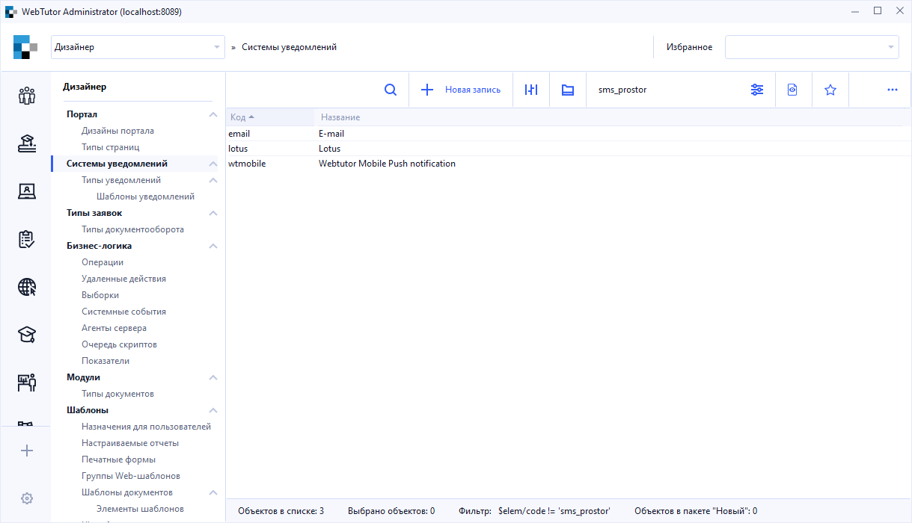

Создаем новую запись и заполняем карточку

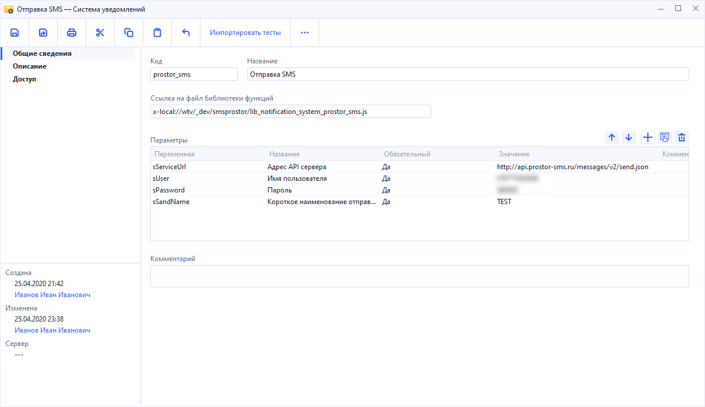

* **Код** - на наше усмотрение
* **Название** - на наше усмотрение
* **Ссылка на файл библиотеки** - ссылка на файл библиотеки
* **sServiceUrl** - указываем адрес API. Для отправки запросов мы будем использовать метод `JSON`. Мы будем использовать адрес `http://api.prostor-sms.ru/messages/v2/send.json`
* **sUSer** - логин, полученный при регистрации в системе "Prostor SMS"
* **sPassword** - пароль, полученный при регистрации в системе "Prostor SMS"
* **sSendName** - короткое наименование, отправитель SMS

## Библиотека для отправки SMS

Библиотека будет написана по аналогии со стандартной библиотекой, той, что используется для отправки Email. Название функции в библиотеке должно строго соответствовать стандартной и называться **SendNotification**. Так же, функция должна возвращать объект с результатом отправки для вывода результата в лог **email**.

Файл библиотеки для отправки SMS. Нужно скопировать в папку на сервере

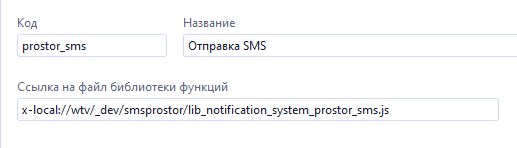

## Пример отправки

Для отправки уведомления создадим шаблон уведомления. Заполним тестовыми данными и будем использовать тип HTML, а так же используем программный код 

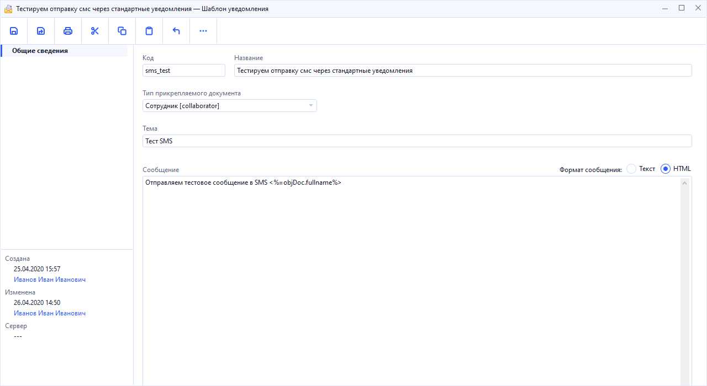

Создадим тип уведомления для отправки нашего шаблона. В качестве системы уведомлений используем наш SMS 

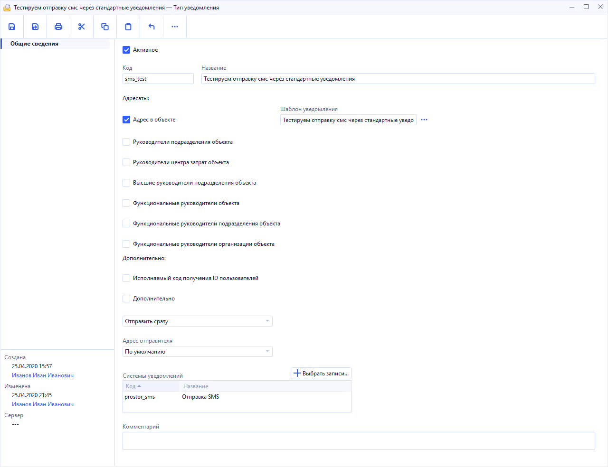

Для запуска процесса отправки используем агент с выполняемым кодом 

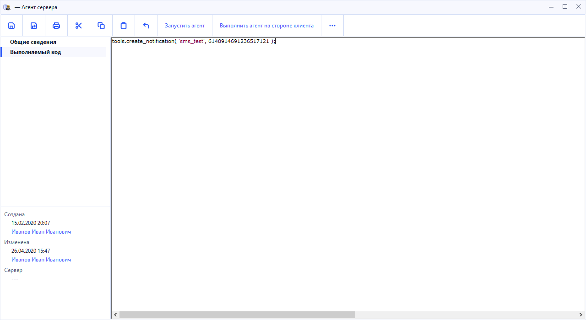

Запускаем агент на стороне сервера и наблюдаем за движением нашего уведомления:

1. Появление в разделе **Неотправленные уведомления**
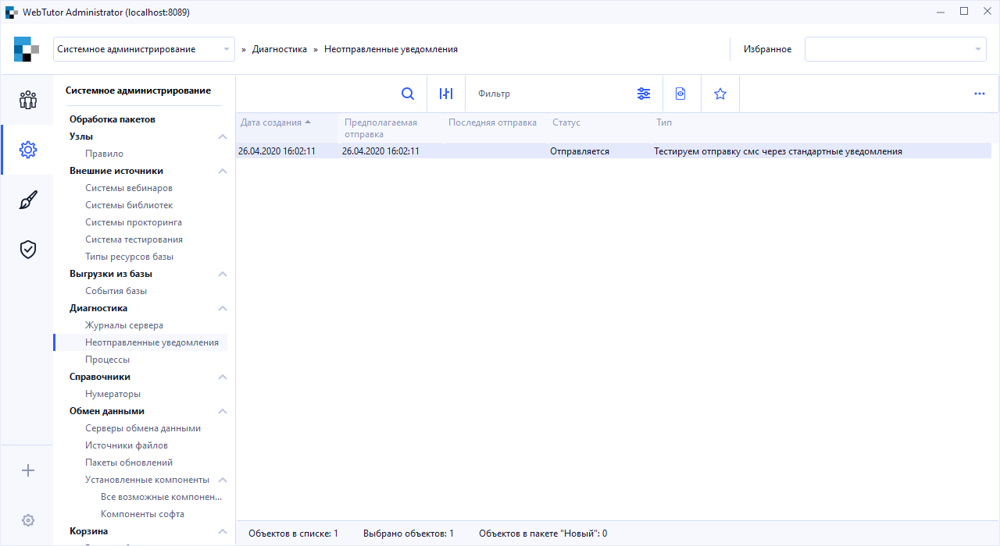
2. В карточке уведомления все стандартно, поле с мобильным номером не заполнено
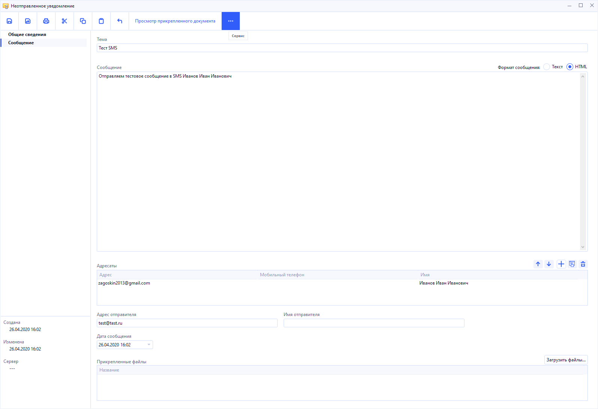
3. После обработки уведомления его статус изменился на **Отправлен**
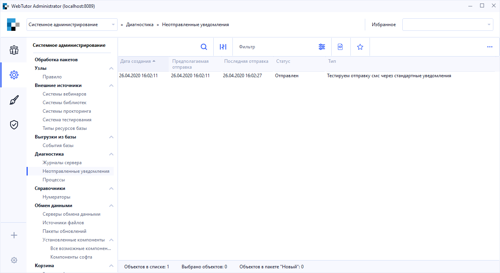
4. В карточке уведомления изменился статус, появился номер телефона для получателя, тип сообщения сменился на текст
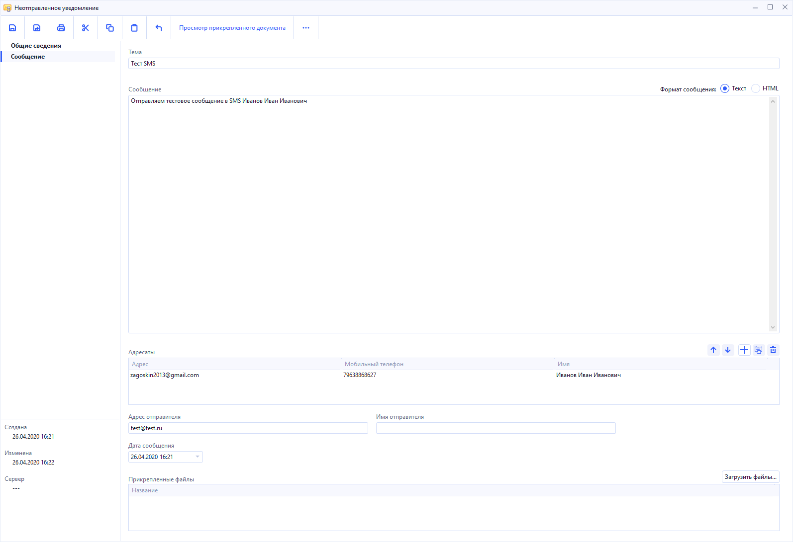
5. В логе **email** видим соответствующее сообщение
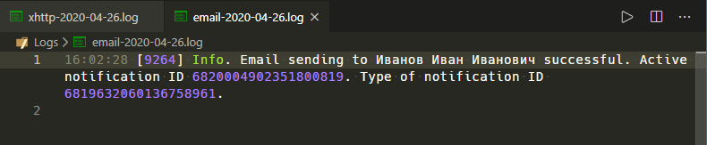
