# Работа с WebSoft.Zip.dll

## Подключение
!!! warning "Работа с .Net библиотеками возможна только на сервере"

!!! warning "Проверялось на следующих версиях WebSoft.Zip.dll"
    - 1.22.6.8
    - 1.22.11.1

Создание класса для работы с библиотекой
```js
oZip = tools.get_object_assembly("Zip")
```

## Методы

* [GetVersion()](#getversion) - Возвращает версию библиотеки.
* [GetError()](#geterror) - Возвращает текст последней ошибки.
* [Save()](#save) - Заглушка: метод возвращает 1, если архив открыт.
* [Close()](#close) - Закрывает архив и освобождает ресурсы.
* [CharSet](#charset) - Свойство с геттером и сеттером. Кодировка для имён файлов.
* [CompressionLevel](#compressionlevel) - Свойство с геттером и сеттером. Уровень сжатия (0 — без сжатия, 1 — сжатие).
* [SetCompressionLevel](#setcompressionlevel)(level) - Устанавливает уровень сжатия (0 — без сжатия, 1 — сжатие).
* [CreateArchive(path)](#createarchive) - Создаёт новый ZIP-архив, удаляя старый при наличии.
* [OpenArchive(path, access)](#openarchive) - Открывает архив с доступом на чтение.
* [OpenOrCreate(path)](#openorcreate) - Открывает существующий архив или создаёт новый.
* [AddFiles(path)](#addfileaddfiles) - Добавляет файлы по маске (*.ext) в корень архива.
* [AddFile(path)](#addfileaddfiles) - То же самое, что AddFiles().
* [AddFilesToPath(path, pathInArchive)](#addfilestopath) - Добавляет файлы с указанием папки в архиве.
* [AddDirectory(path)](#adddirectory) - Добавляет все файлы и папки из указанной директории.
* [AddDirectoryToPath(path, pathInArchive)](#adddirectorytopath) - То же самое, но с указанием относительного пути в архиве.
* [Extract(outputPath)](#extract) - Извлекает всё содержимое архива в указанный каталог.
* [ExtractFiles(path, dirInArchive, outputPath)](#extractfiles) - Извлекает файл из подкаталога архива.
* [ListFiles()](#listfiles) - Возвращает список всех файлов в архиве.

### GetVersion

Возвращает текующую версию библиотеки

=== "Код"
    ```js
    oZip = tools.get_object_assembly("Zip")
    var version = oZip.GetVersion()
    alert(version)
    ```

=== "Результат"
    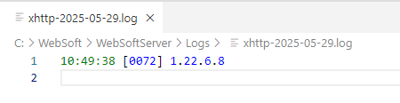

### GetError

Возвращает текст последней ошибки.

!!! warning "ВАЖНО"
    Эксперименты проводились в агенте, который запускался на стороне сервера. Если при первом запуске агента сгенерировать ошибку, потом запустить агент, где будет **только** вывод ошибки, `GetError()` будет содержать ошибку из первого запуска. Перезагрузка сервера ошибку не очищает.
    
    Библиотека кешируется.

Для получения ошибки попытаемся открыть несуществующий архив

=== "Код"
    ```js
    oZip = tools.get_object_assembly("Zip")
    // Архив other.zip не существует
    oZip.OpenArchive(UrlToFilePath('x-local://trash/other.zip'))
    alert(oZip.GetError())
    ```
=== "Результат"
    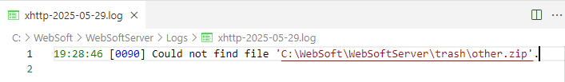

### Save

Используется в связке с `Close()` в коробочном коде. Но в `dll` он просто возвращает 1, если архив открыт.

=== "Код"
    ```js
    oZip = tools.get_object_assembly("Zip")

    ...
    // Работа с архивом
    ...

    oZip.Save()
    oZip.Close()
    oZip = null
    ```

### Close

Закрывает архив

=== "Код"
    ```js
    oZip = tools.get_object_assembly("Zip")

    ...
    // Работа с архивом
    ...

    oZip.Save()
    oZip.Close()
    oZip = null
    ```

### CharSet

!!! note "Информация"
    Кодировка меняется глобально, так как после перезагрузки сервера значение сохраняется.

    Библиотека кешируется.

Использование в качестве геттера возвращает текущую кодировку по умолчанию

=== "Код"
    ```js
    oZip = tools.get_object_assembly("Zip")
    var charset = oZip.CharSet
    alert(charset)
    ```
=== "Результат"
    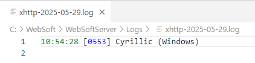

Использование в качестве сеттера - устанавливаем свою кодировку

=== "Код"
    ```js
    oZip = tools.get_object_assembly("Zip")
    var charsetDefault = oZip.CharSet
    alert("Кодировка по умолчанию: " + charsetDefault)

    oZip.CharSet = "utf-8"
    var charsetNew = oZip.CharSet
    alert("Кодировка новая: " + charsetNew)
    ```
=== "Результат"
    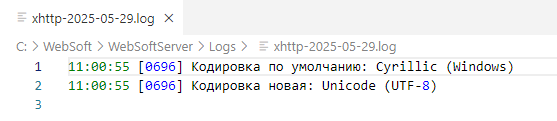

При работе с файлами и папками в названии которых используется кириллица, необходимо менять кодировку на `utf-8`, иначе названия файлов превращаются в иероглифы

Создадим архивы с кодировкой `windows-1251` и кодировкой `utf-8`. Посмотрим что вышло в каждом случае

=== "Структура данных"
    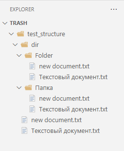
=== "Код создания архивов"
    ```js
    oZip = tools.get_object_assembly("Zip")
    oZip.CharSet = "windows-1251" // "utf-8", "windows-1251"
    oZip.OpenOrCreate(UrlToFilePath('x-local://trash/archiveWindows1251.zip'))
    oZip.AddDirectory(UrlToFilePath('x-local://trash/test_structure'))
    oZip.Save()
    oZip.Close()
    oZip = null

    oZip = tools.get_object_assembly("Zip")
    oZip.CharSet = "utf-8" // "utf-8", "windows-1251"
    oZip.OpenOrCreate(UrlToFilePath('x-local://trash/archiveUtf8.zip'))
    oZip.AddDirectory(UrlToFilePath('x-local://trash/test_structure'))
    oZip.Save()
    oZip.Close()
    oZip = null
    ```
=== "Результат"
    Распаковываем арихивы `archiveWindows1251.zip` и `archiveUtf8.zip` и смотрим кодировку  
    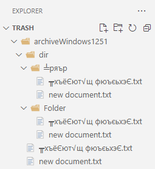
    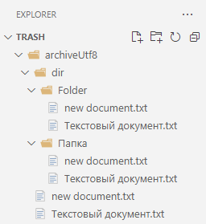

    !!! note "Информация"
        Все манипуляции распаковки производились стандартным распаковщиком Windows 11 и 7-zip.  
        При распаковке WinRar кодировка корректная

### CompressionLevel

!!! note "Информация"
    Уровень сжатия меняется глобально, так как после перезагрузки сервера значение сохраняется. 

    Библиотека кешируется.

Использование в качестве геттера возвращает текущий уровень сжатия

=== "Код"
    ```js
    oZip = tools.get_object_assembly("Zip")
    var compressionLevel = oZip.CompressionLevel
    alert("Сжатие по умолчанию: " + compressionLevel)
    ```
=== "Результат"
    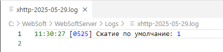

Использование в качестве сеттера - устанавливаем своё сжатие

=== "Код"
    ```js
    oZip = tools.get_object_assembly("Zip")
    var compressionLevelDefault = oZip.CompressionLevel
    alert("Сжатие по умолчанию: " + compressionLevelDefault)

    oZip.CompressionLevel = 0
    var compressionLevelNew = oZip.CompressionLevel
    alert("Сжатие новое: " + compressionLevelNew)
    ```
=== "Результат"
    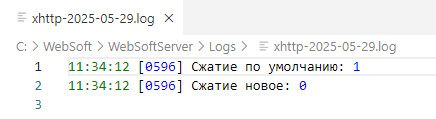

Измерения уровней сжатия в качестве эксперимента от 0 до 10 показали, что есть только 2 уровня 0 или 1.

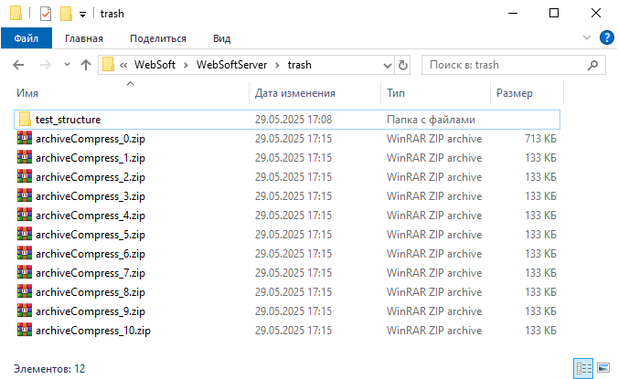

### SetCompressionLevel

Устанавливает уровень сжатия. Делает то же самое что и геттер `CompressionLevel`, только тут это метод с параметром.

Возвращает `1` при успешной установке уровня сжатия и `0` - если что-то пошло не так

=== "Код"
    ```js
    oZip = tools.get_object_assembly("Zip")
    oZip.SetCompressionLevel(0)
    oZip.OpenOrCreate(UrlToFilePath('x-local://trash/archiveCompress_0.zip'))
    oZip.AddDirectory(UrlToFilePath('x-local://trash/test_structure'))
    oZip.Save()
    oZip.Close()
    oZip = null

    oZip = tools.get_object_assembly("Zip")
    oZip.SetCompressionLevel(1)
    oZip.OpenOrCreate(UrlToFilePath('x-local://trash/archiveCompress_1.zip'))
    oZip.AddDirectory(UrlToFilePath('x-local://trash/test_structure'))
    oZip.Save()
    oZip.Close()
    oZip = null
    ```
=== "Результат"
    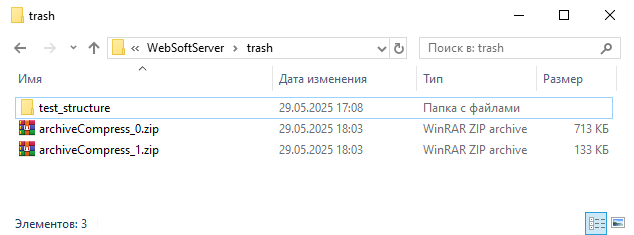

### CreateArchive

Создает пустой архив по переданному пути.  
Возвращает `1` при успешном создании архива и `0` - если что-то пошло не так

!!! warning "ВАЖНО"
    Работает только с файловыми путями. Не работает, если указать путь вида `x-local://trash/archive.zip`

!!! warning "ВАЖНО"
    Если такой архив уже существует, то он будет удален и создан новый пустой

=== "Код"
    ```js
    oZip = tools.get_object_assembly("Zip")
    oZip.CreateArchive(UrlToFilePath('x-local://trash/archive.zip'))
    oZip.Save()
    oZip.Close()
    oZip = null
    ```
=== "Результат"
    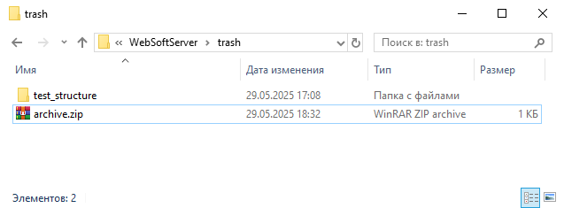

### OpenArchive

Открывает существующий архив. Архив доступен только для чтения.  
Возвращает `1` при успешном открытии архива и `0` - если что-то пошло не так

!!! info "Информация"
    Второй параметр `access` как будто-бы не работает, в dll указано 6 доступов открытия, но указание любого уровня вторым параметром генерирует ошибку

    CreateNew = 1, Create = 2, Open = 3, OpenOrCreate = 4, Truncate = 5, Append = 6,

=== "Код"
    ```js
    oZip = tools.get_object_assembly("Zip")
    oZip.OpenArchive(UrlToFilePath('x-local://trash/archive.zip'))
    var listFiles = oZip.ListFiles()
    alert(tools.object_to_text(listFiles, "json"))

    oZip.Save()
    oZip.Close()
    oZip = null
    ```
=== "Результат"
    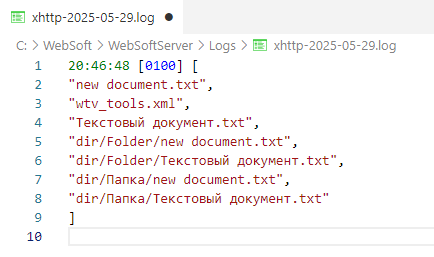

### OpenOrCreate

Метод позволяет открыть архив и дописать в него файлы, что нельзя сделать через `OpenArchive`. Если архив не существует, то метод его создает.

=== "Код"
    ```js
    oZip = tools.get_object_assembly("Zip")
    oZip.CreateArchive(UrlToFilePath('x-local://trash/archive.zip'))
    oZip.AddFile(UrlToFilePath('x-local://trash/test_structure/new document.txt'))
    oZip.Save()
    oZip.Close()
    oZip = null

    oZip = tools.get_object_assembly("Zip")
    oZip.OpenOrCreate(UrlToFilePath('x-local://trash/archive.zip'))
    oZip.AddFile(UrlToFilePath('x-local://trash/test_structure/wtv_tools.xml'))
    oZip.Save()
    oZip.Close()
    oZip = null
    ```
=== "Результат"
    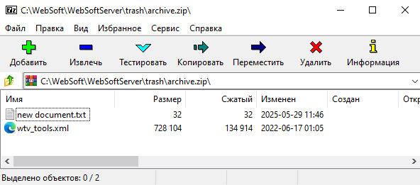

### AddFile/AddFiles

Добавляем один файл

=== "Список файлов"
    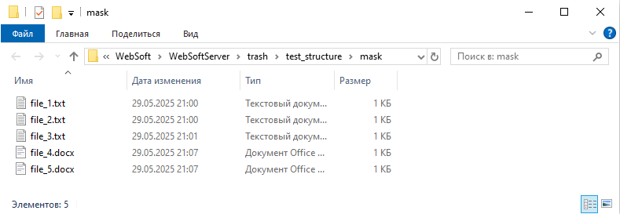
=== "Код"
    ```js
    oZip = tools.get_object_assembly("Zip")
    oZip.OpenOrCreate(UrlToFilePath('x-local://trash/archive.zip'))
    oZip.AddFile(UrlToFilePath('x-local://trash/test_structure/mask/file_1.txt'))

    oZip.Save()
    oZip.Close()
    oZip = null
    ```
=== "Результат"
    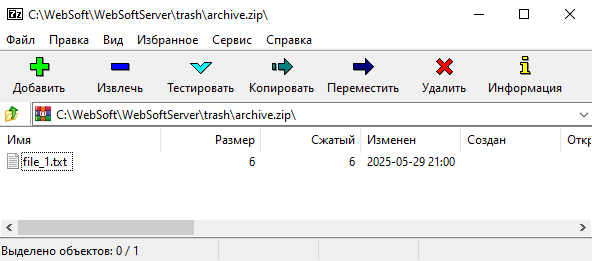

Добавляем несколько файлов используя символ подстановки `*`

=== "Список файлов"
    
=== "Код"
    ```js
    oZip = tools.get_object_assembly("Zip")
    oZip.OpenOrCreate(UrlToFilePath('x-local://trash/archive.zip'))
    oZip.AddFile(UrlToFilePath('x-local://trash/test_structure/mask/*.txt'))

    oZip.Save()
    oZip.Close()
    oZip = null
    ```
=== "Результат"
    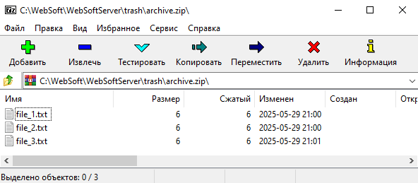

### AddFilesToPath

=== "Список файлов"
    
=== "Код"
    ```js
    oZip = tools.get_object_assembly("Zip")
    oZip.CreateArchive(UrlToFilePath('x-local://trash/archive.zip'))
    oZip.AddFilesToPath(UrlToFilePath('x-local://trash/test_structure/mask/file_*.docx'), 'deep_folder')

    oZip.Save()
    oZip.Close()
    oZip = null
    ```
=== "Результат"
    !!! info "Файлы в архиве находятся в папке `deep_folder`"
    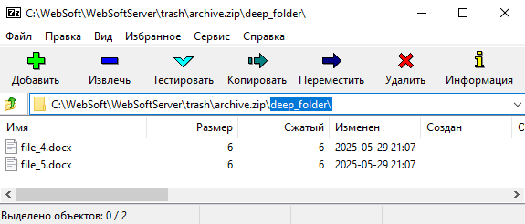

### AddDirectory

=== "Список файлов"
    
=== "Код"
    ```js
    oZip = tools.get_object_assembly("Zip")
    oZip.CreateArchive(UrlToFilePath('x-local://trash/archive.zip'))
    oZip.AddDirectory(UrlToFilePath('x-local://trash/test_structure'))

    oZip.Save()
    oZip.Close()
    oZip = null
    ```
=== "Результат"
    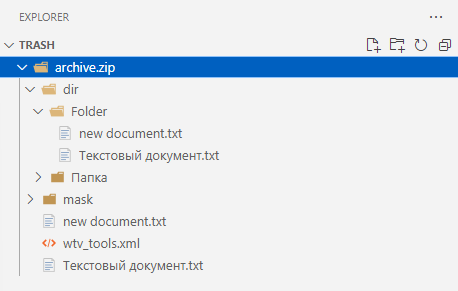

### AddDirectoryToPath

=== "Список файлов"
    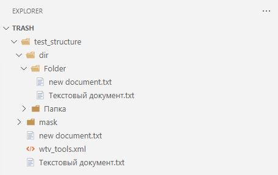
=== "Код"
    ```js
    oZip = tools.get_object_assembly("Zip")
    oZip.CreateArchive(UrlToFilePath('x-local://trash/archive.zip'))
    oZip.AddDirectoryToPath(UrlToFilePath('x-local://trash/test_structure'), 'deep_folder')

    oZip.Save()
    oZip.Close()
    oZip = null
    ```
=== "Результат"
    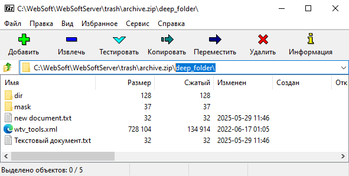

### Extract

=== "Код"
    ```js
    oZip = tools.get_object_assembly("Zip")
    oZip.OpenArchive(UrlToFilePath('x-local://trash/archive.zip'))
    oZip.Extract(UrlToFilePath('x-local://trash/extract_archive/'))

    oZip.Close()
    oZip = null
    ```
=== "Результат"
    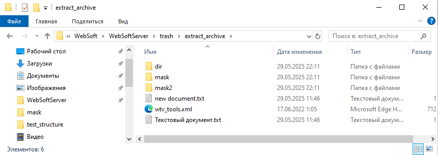

### ExtractFiles

!!! warning "ВАЖНО"
    Первый параметр - не используется.  
    Второй параметр - путь к файлу относительно корня архива. Подстановки не работают

=== "Код"
    ```js
    oZip = tools.get_object_assembly("Zip")
    oZip.OpenArchive(UrlToFilePath('x-local://trash/archive.zip'))
    oZip.ExtractFiles('', 'mask/file_1.txt', UrlToFilePath('x-local://trash/testUnzipFolder'))

    oZip.Close()
    oZip = null
    ```
=== "Результат"
    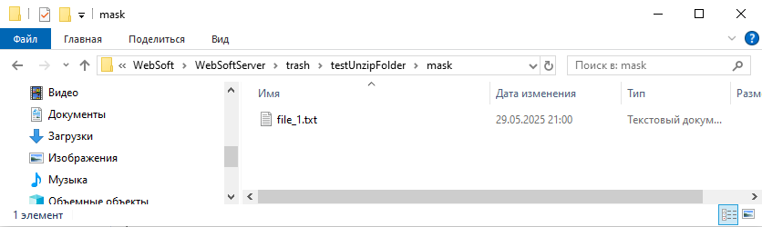

### ListFiles

=== "Код"
    ```js
    oZip = tools.get_object_assembly("Zip")
    oZip.OpenArchive(UrlToFilePath('x-local://trash/archive.zip'))
    var listFiles = oZip.ListFiles()
    alert(tools.object_to_text(listFiles, "json"))

    oZip.Close()
    oZip = null
    ```
=== "Результат"
    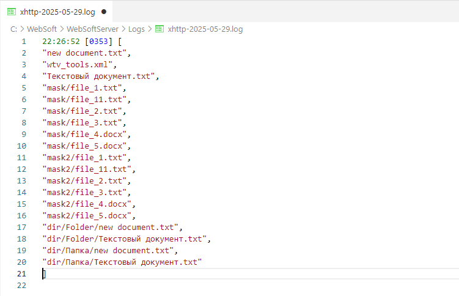