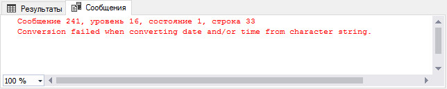
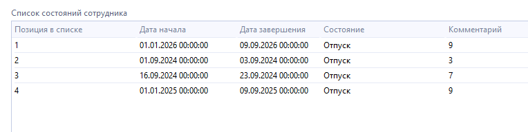
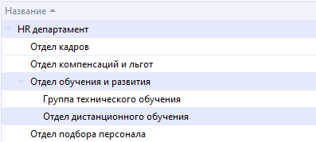

# Практическое руководство по работе с полями XML в MS SQL

Для работы с XML полями используются методы SQL Server.

Все методы описаны в официальном [руководстве Microsoft](https://learn.microsoft.com/ru-ru/sql/t-sql/xml/xml-data-type-methods?view=sql-server-ver16).

Так же есть хорошее описание на сайте [sql-tutorial.ru](http://www.sql-tutorial.ru/ru/book_xml_data_type_methods.html).

!!! warning "ВАЖНО!"
    В статье используется база данных, в которой таблицы **ОТВЯЗАНЫ** от XML схем. При привязанных XML схемах некоторые запросы не будут выполнены.

    Чтобы посмотреть привязку таблицы к XML схеме, можно выполнить следующий запрос, который выведет привязанные схемы

    **Запрос**

    ```sql
    select  *
    from    sys.xml_schema_collections XSC 
            join sys.xml_schema_namespaces XSN on (XSC.xml_collection_id = XSN.xml_collection_id)
    where    XSC.name = 'position';
    ```

    **Результат**

    

## Основные методы для работы с XML

!!! warning "Нумерация узлов в XML документах начинается с 1"

В методах для поиска узла используются языки запросов `XPath` или `XQuery`.

Для работы с XML документом в T-SQL используются следующие методы:

* **query**
* **value**
* **exist**
* **nodes**
* **modify**

### Метод query

Метод `query` используется для извлечения XML узлов. Метод возвращает экземпляр нетипизированного XML.

```sql
data.query('XPath')
```

### Метод value

Метод `value` извлекает значение узла с указанием типа данных. Данный метод возвращает скалярное значение. При невозможности преобразовать данные в нужный тип — сервер выкидывает ошибку. Нужно явно указывать номер узла, за исключением использования оператора точка `'.'` - выбрать все содержимое.

```sql
data.value('XPath', 'DataType')
```

### Метод exist

Метод `exist` проверяет существование указанного выражения `XPath`. Возвращает значение типа `bit`, которое представляет одно из следующих состояний:

* **1** - означающее `True`, если выражение на языке `XQuery` при запросе возвращает непустой результат, то есть возвращается как минимум один узел `XML`.
* **0** - означающее `False` при возвращении пустого результата.
* **NULL** - если экземпляр типа `xml`, к которому был выполнен запрос, содержит значение `NULL`.

```sql
data.exist('XPath')
```

### Метод nodes

Метод `nodes` разбивает XML документ в соответствии с указанным выражением `XPath`, создавая при этом собственную таблицу из найденных XML узлов.

```sql
data.nodes('XPath') as Table(Column)
```

**Пример**. У нас есть XML документ со следующей структурой:

```xml
<root>
    <label>Макароны</label>
    <value>200 гр</value>
    <label>Фрукты</label>
    <value>400 гр</value>
    <label>Орехи</label>
    <value>100 гр</value>
</root>
```

Использование метода `nodes('root/value') AS Table1(field)` приведет к созданию таблицы `Table1` и столбцом `field`, где каждая строка — это найденный узел по выражению `Xpath`


Метод используется в сочетании с другими методами или с оператором `CROSS APPLY`. Использование с оператором `CROSS APPLY` создаст эффект `LEFT JOIN` исходной таблицы с таблицей, созданной `nodes`.

### Метод modify

Метод `modify` изменяет XML документ. Используется преимущественно в выражении `UPDATE` и может за один раз изменить только одно значение.

Для метода существует 3 ключевых оператора:

* **[insert](#insert)**
* **[delete](#delete)**
* **[replace value of](#replace-value-of)**

Каждый оператор говорит сам за себя: вставка, удаление, замена значения.

#### insert

Оператор `insert` позволяет добавлять XML элементы. Имеет следующие вспомогательные операторы для уточнения места добавления:

```sql
data.modify('insert (<field>...</field>) into (XPath)')
```

* `{ as first || as last } into` - добавляет данные в узел как дочерние. `as last` добавляет последним потомком, является поведением по умолчанию. `as first into` добавит данные первым потомком.
* `after` - добавляет данные после указанного узла.
* `before` - добавляет данные перед указанным узлом.

#### delete

Оператор `delete` удаляет часть XML документа найденного по выражению `XPath`.

```sql
data.modify('delete (XPath)')
```

#### replace value of

Оператор `replace value of` изменяет содержимое узла.

```sql
data.modify('replace value of (XPath) with (value)')
```

## Сборник задач SQL

### Получаем первый XML узел по его имени

Найдем первый узел с именем `lastname`

**Запрос**

```sql
select  data.query('(/collaborator/lastname)[1]')
from    collaborator
where	id = 6148914691236517121
```

**Результат**

=== "MSSQL"
    
=== "XML"
    ```xml
    <lastname>Иванов</lastname>
    ```

В результате получим первый узел `lastname` со всем его содержимым. Номер узла для получения задается `[1]`

### Получаем все XML узлы по имени

Найдем все узлы с именем `name`. В нашем документе всего три узла с таким именем и все они вложены в разные элементы `custom_elem`

**Запрос**

```sql
select  data.query('(/collaborator/custom_elems/custom_elem/name)')
from    collaborator
where	id = 6148914691236517121
```

**Результат**

=== "MSSQL"
    
=== "XML"
    ```xml
    <name>fld_city</name>
    <name>fld_sex</name>
    <name>fld_birth_date</name>
    ```

В результате получим все найденные узлы по указанному пути, так как мы не указали номер узла, который нам нужен

### Получаем узел со всем его содержимым

Найдем узлы кастомных полей с его родителем. Кастомные поля хранятся в узлах с именем `custom_elem`, корневой узел для которых `custom_elems`

**Запрос**

```sql
select  data.query('(/collaborator/custom_elems)')
from    collaborator
where	id = 6148914691236517121
```

**Результат**

=== "MSSQL"
    
=== "XML"
    ```xml
    <custom_elems>
        <custom_elem>
            <name>fld_city</name>
            <value>Киров</value>
        </custom_elem>
        <custom_elem>
            <name>fld_sex</name>
            <value>М</value>
        </custom_elem>
        <custom_elem>
            <name>fld_birth_date</name>
            <value>1988-06-02T00:00:00+00:00</value>
        </custom_elem>
    </custom_elems>
    ```

В результате получим узел `custom_elems` со всеми вложенными узлами

### Получаем XML узел по номеру родителя

Найдем узел `name` из второго узла `custom_elem`. Для этого используем явное указание номера элемента

**Запрос**

```sql
select  data.query('(collaborator/custom_elems/custom_elem[2]/name)')
from    collaborator
where	id = 6148914691236517121
```

**Результат**

=== "MSSQL"
    
=== "XML"
    ```xml
    <name>fld_sex</name>
    ```

В результате получим элемент `name` из второго по счету элемента `custom_elem`

### Получаем XML узел по значению его вложенного узла

Найдем узел `custom_elem` в котором содержится узел `name` со значением `fld_city`

**Запрос**

```sql
select  data.query('(/collaborator/custom_elems/custom_elem[name="fld_city"])[1]')
from    collaborator
where	id = 6148914691236517121
```

**Результат**

=== "MSSQL"
    
=== "XML"
    ```xml
    <custom_elem>
        <name>fld_city</name>
        <value>Киров</value>
    </custom_elem>
    ```

Конструкция `...custom_elem[name="fld_city"]...` ищет узел `custom_elem` в котором находится узел `name` со значением `fld_city` и возвращает подительский узел `custom_elem`

### Получаем XML узел по значению соседнего XML узла

Найдем элемент `value`, который находится в элементе `custom_elem`, где вложенный элемент `name` имеет значение `fld_city`.

**Запрос**

```sql
select  data.query('(/collaborator/custom_elems/custom_elem[name="fld_city"]/value)[1]')
from    collaborator
where	id = 6148914691236517121
```

**Результат**

=== "MSSQL"
    
=== "XML"
    ```xml
    <value>Киров</value>
    ```

### Получаем значение XML узла

Найдем значения узлов с основными данными сотрудника (ИД, фамилию, дату рождения и флаг уволен сотрудник или нет)

**Запрос**

```sql
select   data.value('(/collaborator/id)[1]', 'bigint') as id
        ,data.value('(/collaborator/lastname)[1]', 'varchar(40)') as lastname
        ,data.value('(/collaborator/birth_date)[1]', 'date') as birth_date
        ,data.value('(/collaborator/is_dismiss)[1]', 'bit') as is_dismiss
from    collaborator
where	id = 6148914691236517121
```

**Результат**


!!! warning "Обратите внимание"
    Если попытаться привести поле `lastname` к дате, то получим ошибку

    

### Получаем значение соседнего XML узла

Найдем значения кастомных полей с именами `fld_city`, `fld_sex` и `fld_birth_date`

**Запрос**

```sql
select   data.value('(/collaborator/custom_elems/custom_elem[name="fld_city"]/value)[1]', 'varchar(50)') as fld_city
        ,data.value('(/collaborator/custom_elems/custom_elem[name="fld_sex"])[1]/value[1]', 'varchar') as fld_sex
        ,data.value('(/collaborator/custom_elems/custom_elem[name="fld_birth_date"]/value)[1]', 'datetime') as fld_birth_date
from    collaborator
where	id = 6148914691236517121
```

**Результат**


Конструкция `...custom_elem[name="fld_city"]/value...` ищет узел с именем `custom_elem`, в который вложен узел `name` со значением `fld_city`. Дальше мы добавляем `/value` - то есть в найденном узле `custom_elem` с вложенным узлом `<name>fld_city</name>` обращаемся к узлу `<value>...</value>` и получаем его значение. На самом деле `name` и `value` это всего лишь имена вложенных узлов

### Получаем значения нескольких соседних узлов XML

Найдем из списка состояний сотрудника `history_states` первое состояние `history_state`, поле `state_id` которого имеет значение `vacation`, и выведем значения узлов `start_date` и `finish_date` в формате даты.

Запрос:
```sql
select   data.value('(/collaborator/history_states/history_state[state_id="vacation"]/start_date)[1]', 'date') as start_date
        ,data.value('(/collaborator/history_states/history_state[state_id="vacation"]/finish_date)[1]', 'date') as finish_date
from    collaborator
where	id = 6148914691236517121
```

**Результат**


### Получаем последний дочерний узел XML

Когда количество узлов неизвестно, можно получить последний узел с помощью функции `last()`, предпоследний `last()-1` и т.д.

**Запрос**

```sql
select   data.value('(/collaborator/custom_elems/custom_elem[last()]/value)[1]', 'varchar(50)') as fld_birth_date
        ,data.value('(/collaborator/custom_elems/custom_elem[last()-1]/value)[1]', 'varchar(50)') as fld_sex
        ,data.value('(/collaborator/custom_elems/custom_elem[last()-2]/value)[1]', 'varchar(50)') as fld_city
        ,data.value('(/collaborator/custom_elems/custom_elem[last()-3]/value)[1]', 'varchar(50)') as not_fount
        ,data.value('(/collaborator/custom_elems/custom_elem[last()-4]/value)[1]', 'varchar(50)') as not_fount
from    collaborator
where	id = 6148914691236517121
```

**Результат**


Если узла не существует - возвращает `NULL`

### Использование агрегации для значений XML узлов

У сотрудника есть 2 отпуска. В комментариях к состоянию хранится количество дней отпуска. Нам нужно получить количество отпусков и их сумму дней. Для этого применим 2 функции `count()` и `sum()`

**Запрос**

```sql
select   data.value('count(/collaborator/history_states/history_state/comment)','int') as count_days
		,data.value('sum(/collaborator/history_states/history_state/comment)','int') as sum_days
from    collaborator
where	id = 6148914691236517121
```

!!! warning "ВАЖНО"
    Конструкция `'sum(/collaborator/history_states/history_state/comment)'` сработает только в том случае, если таблица отвязана от XML схемы, иначе будет ошибка типов

    

**Результат**


### Проверяем XML узел

Проверим существование XML узла в документах - `password`

**Запрос**

```sql
select   data.value('(/collaborator/login)[1]','varchar(50)') as lastname
        ,data.value('(/collaborator/password)[1]','varchar(50)') as password
        ,data.exist('(/collaborator/password)') as exist_password
from    collaborator
```

**Результат**


!!! info "Обратите внимание"
    Наличие значения в узле `password` не влияет на результат

    

### Проверяем равенство значения XML узла с нашим значением

Найдем все строки с узлом `lastname` и его значение `Иванов`. Регистр важен

**Запрос**

```sql
select   data.value('(/collaborator/lastname)[1]','varchar(50)') as lastname
        ,data.exist('(/collaborator/lastname[text()="Иванов"])') as exist_lastname
from    collaborator
order by data.exist('(/collaborator/lastname[text()="Иванов"])') desc
```

**Результат**


### Проверяем, содержит ли значение XML узла подстроку

**Запрос**

```sql
select   data.value('(/collaborator/lastname)[1]','varchar(50)') as lastname
        ,data.exist('/collaborator/lastname/text()[contains(., "ван")]') as exist_lastname
from    collaborator
order by data.exist('/collaborator/lastname/text()[contains(., "ван")]') desc
```

**Результат**


В примере используется дополнительная конструкция `[contains(., "ван")]`. Функция `contains(str, substr)` проверяет, содержит ли строка `str` подстроку `substr`. Оператор `.` - возвращает все найденное содержимое предшествующему запросу `XPath` - значение узла `lastname`. Регистр важен

### Проверяем значение кастомного поля в WebTutor

Найдем все записи, где `custom_elem` содержит узел `name` со значением `fld_city` и узел `value` со значением `Киров`

**Запрос**

```sql
select   data.value('(/collaborator/lastname)[1]','varchar(50)') as lastname
        ,data.value('(/collaborator/custom_elems/custom_elem[name="fld_city"]/value)[1]','varchar(50)') as message_sent
        ,data.exist('/collaborator/custom_elems/custom_elem[name="fld_city"]/value[text() = "Киров"]') as exist_result
from    collaborator
order by data.exist('/collaborator/custom_elems/custom_elem[name="fld_city"]/value[text() = "Киров"]') desc
```

**Результат**


### Разделяем по разным строкам каждый найденный XML узел

Для каждого имеющегося узла `custom_elem` выведем значения его дочерних узлов

**Запрос**

```sql
select   data.value('(/collaborator/id)[1]','bigint') as id
        ,Table1.field.query('.') as nodes_element
from    collaborator
        cross apply collaborator.data.nodes('(/collaborator/custom_elems/custom_elem)') as Table1(field)
where	id = 6148914691236517121
```

**Результат**

Получим строки с каждым найденным `custom_elem`, оператор `.` в методе `query` выведет все содержимое найденного узла


Доработаем запрос и добавим вывод значений дочерних узлов внутри `custom_elem`

**Запрос**

```sql
select   data.value('(/collaborator/id)[1]','bigint') as id
        ,Table1.field.query('.') as nodes_element
        ,Table1.field.query('name') as nodes_name
        ,Table1.field.query('./value') as nodes_value
from    collaborator
        cross apply collaborator.data.nodes('(/collaborator/custom_elems/custom_elem)') as Table1(field)
where	id = 6148914691236517121
```

**Результат**

Благодаря тому, что метод `nodes` возвращает свой собственный XML документ, мы можем обращаться к его содержимому относительного этого документа


**Запрос**

Доработаем запрос и для найденных элементов получим их значения

```sql
select   data.value('(/collaborator/id)[1]','bigint') as id
        ,Table1.field.query('.') as nodes_element
        ,Table1.field.query('name').value('.', 'varchar(100)') as nodes_name
        ,Table1.field.value('(./value)[1]', 'varchar(100)') as nodes_value
from    collaborator
        cross apply collaborator.data.nodes('(/collaborator/custom_elems/custom_elem)') as Table1(field)
where	id = 6148914691236517121
```

**Результат**

Мы получили желаемый результат, у нас есть название кастомного поля и его значение


### Получаем порядковые номера XML узлов на одном уровне

Для получения порядковых номеров мы будем использовать метод `nodes` и его особенность, при которой узлы возвращаются в порядке их следования в XML документе. Получим порядковые номера всех кастомных полей `custom_elem`.

**Запрос**

```sql
select   id
        ,Table1.field.query('.') as query
        ,Table1.field.value('count( for $s in (/collaborator/custom_elems/custom_elem) where $s << . return(.) ) + 1', 'int') as node_number
        ,row_number() over (partition by id order by id) as node_number_light
from    collaborator
        cross apply collaborator.data.nodes('(/collaborator/custom_elems/custom_elem)') as Table1(field)
where	id = 6148914691236517121
```

**Результат**


В методе `value` используется запрос `XQuery` и побитовая операция `<<`. Говоря простым языком, конструкция `count( for $s in (/collaborator/custom_elems/custom_elem) where $s << . return(.) )` возвращает количество всех предшествующих узлов относительно текущего, возвращенного методом `nodes`

То есть, для первого `custom_elem` нет предшествующих узлов, поэтому количество будет равно `0`. Следующим метод `nodes` возвращает второй `custom_elem`, количество предшествующих узлов становится `1` и так далее. Обратите внимание, путь до узла в методе `nodes` полностью соответствует пути в запросе `XQuery`. Так как конструкция считает количество предшествующих элементов, то отсчет начинается с `0`. Так как функция `count` возвращает число, мы можем производить над результатом математические операции

Существует более простой способ получить порядковые номера узлов, можно использовать оконную функцию `ROW_NUMBER`, которая легче в понимании и даёт аналогичный результат

### Добавляем XML узел в документ

Добавим новый узел `history_state` в родительский `history_states`

**Запрос**

```sql
update  collaborator
set     data.modify('insert
					<history_state>
						<id>hpb91b</id>
						<state_id>vacation</state_id>
						<start_date>2025-01-01T00:00:00+00:00</start_date>
						<finish_date>2025-09-09T00:00:00+00:00</finish_date>
						<comment>9</comment>
					</history_state>
                    into
                    (collaborator/history_states)[1]
        ')
where   id = 6148914691236517121
```

**Результат**

=== "XML до"
    ```xml
    <collaborator SPXML-FORM="x-local://wtv/wtv_collaborator.xmd">
        <id>6148914691236517121</id>
        <lastname>Иванов</lastname>
        ...
        <history_states>
            <history_state>
                <id>92d6c6</id>
                <state_id>vacation</state_id>
                <start_date>2024-09-01T00:00:00+00:00</start_date>
                <finish_date>2024-09-03T00:00:00+00:00</finish_date>
                <comment>3</comment>
            </history_state>
            <history_state>
                <id>hpb91a</id>
                <state_id>vacation</state_id>
                <start_date>2024-09-16T00:00:00+00:00</start_date>
                <finish_date>2024-09-23T00:00:00+00:00</finish_date>
                <comment>7</comment>
            </history_state>
        </history_states>
        ...
    </collaborator>
    ```
=== "XML после"
    ```xml
    <collaborator SPXML-FORM="x-local://wtv/wtv_collaborator.xmd">
        <id>6148914691236517121</id>
        <lastname>Иванов</lastname>
        ...
        <history_states>
            <history_state>
                <id>92d6c6</id>
                <state_id>vacation</state_id>
                <start_date>2024-09-01T00:00:00+00:00</start_date>
                <finish_date>2024-09-03T00:00:00+00:00</finish_date>
                <comment>3</comment>
            </history_state>
            <history_state>
                <id>hpb91a</id>
                <state_id>vacation</state_id>
                <start_date>2024-09-16T00:00:00+00:00</start_date>
                <finish_date>2024-09-23T00:00:00+00:00</finish_date>
                <comment>7</comment>
            </history_state>
            <history_state>
                <id>hpb91b</id>
                <state_id>vacation</state_id>
                <start_date>2025-01-01T00:00:00+00:00</start_date>
                <finish_date>2025-09-09T00:00:00+00:00</finish_date>
                <comment>9</comment>
            </history_state>
        </history_states>
        ...
    </collaborator>
    ```
=== "Карточка сотрудника"
    

Оператор `into` добавляет узел последним потомком. Для точного указания места вставки используются ключевые слова `as first` и `as last`

**Запрос**

```sql
update  collaborator
set     data.modify('insert
					<history_state>
						<id>hpb91c</id>
						<state_id>vacation</state_id>
						<start_date>2026-01-01T00:00:00+00:00</start_date>
						<finish_date>2026-09-09T00:00:00+00:00</finish_date>
						<comment>9</comment>
					</history_state>
                    as first into
                    (collaborator/history_states)[1]
        ')
where   id = 6148914691236517121
```

**Результат**

=== "XML до"
    ```xml
    <collaborator SPXML-FORM="x-local://wtv/wtv_collaborator.xmd">
        <id>6148914691236517121</id>
        <lastname>Иванов</lastname>
        ...
        <history_states>
            <history_state>
                <id>92d6c6</id>
                <state_id>vacation</state_id>
                <start_date>2024-09-01T00:00:00+00:00</start_date>
                <finish_date>2024-09-03T00:00:00+00:00</finish_date>
                <comment>3</comment>
            </history_state>
            <history_state>
                <id>hpb91a</id>
                <state_id>vacation</state_id>
                <start_date>2024-09-16T00:00:00+00:00</start_date>
                <finish_date>2024-09-23T00:00:00+00:00</finish_date>
                <comment>7</comment>
            </history_state>
            <history_state>
                <id>hpb91b</id>
                <state_id>vacation</state_id>
                <start_date>2025-01-01T00:00:00+00:00</start_date>
                <finish_date>2025-09-09T00:00:00+00:00</finish_date>
                <comment>9</comment>
            </history_state>
        </history_states>
        ...
    </collaborator>
    ```
=== "XML после"
    ```xml
    <collaborator SPXML-FORM="x-local://wtv/wtv_collaborator.xmd">
        <id>6148914691236517121</id>
        <lastname>Иванов</lastname>
        ...
        <history_states>
            <history_state>
                <id>hpb91c</id>
                <state_id>vacation</state_id>
                <start_date>2026-01-01T00:00:00+00:00</start_date>
                <finish_date>2026-09-09T00:00:00+00:00</finish_date>
                <comment>9</comment>
            </history_state>
            <history_state>
                <id>92d6c6</id>
                <state_id>vacation</state_id>
                <start_date>2024-09-01T00:00:00+00:00</start_date>
                <finish_date>2024-09-03T00:00:00+00:00</finish_date>
                <comment>3</comment>
            </history_state>
            <history_state>
                <id>hpb91a</id>
                <state_id>vacation</state_id>
                <start_date>2024-09-16T00:00:00+00:00</start_date>
                <finish_date>2024-09-23T00:00:00+00:00</finish_date>
                <comment>7</comment>
            </history_state>
            <history_state>
                <id>hpb91b</id>
                <state_id>vacation</state_id>
                <start_date>2025-01-01T00:00:00+00:00</start_date>
                <finish_date>2025-09-09T00:00:00+00:00</finish_date>
                <comment>9</comment>
            </history_state>
        </history_states>
        ...
    </collaborator>
    ```
=== "Карточка сотрудника"
    

### Добавляем XML узел на указанную позицию

**Запрос**

```sql
declare	@comment varchar(100) = 'Вставили коммент';

update  collaborator
set     data.modify('insert
                    <comment>{ sql:variable("@comment") }</comment>
                    after
                    (collaborator/history_states/history_state[1]/finish_date)[1]
        ')
where   id = 6148914691236517121
```

**Результат**

=== "XML до"
    ```xml
    <collaborator SPXML-FORM="x-local://wtv/wtv_collaborator.xmd">
        <id>6148914691236517121</id>
        <lastname>Иванов</lastname>
        ...
        <history_states>
            <history_state>
                <id>92d6c6</id>
                <state_id>vacation</state_id>
                <start_date>2024-09-01T00:00:00+00:00</start_date>
                <finish_date>2024-09-03T00:00:00+00:00</finish_date>
            </history_state>
            <history_state>
                <id>hpb91a</id>
                <state_id>vacation</state_id>
                <start_date>2024-09-16T00:00:00+00:00</start_date>
                <finish_date>2024-09-23T00:00:00+00:00</finish_date>
                <comment>7</comment>
            </history_state>
        </history_states>
        ...
    </collaborator>
    ```
=== "XML после"
    ```xml
    <collaborator SPXML-FORM="x-local://wtv/wtv_collaborator.xmd">
        <id>6148914691236517121</id>
        <lastname>Иванов</lastname>
        ...
        <history_states>
            <history_state>
                <id>92d6c6</id>
                <state_id>vacation</state_id>
                <start_date>2024-09-01T00:00:00+00:00</start_date>
                <finish_date>2024-09-03T00:00:00+00:00</finish_date>
                <comment>Вставили коммент</comment>
            </history_state>
            <history_state>
                <id>hpb91a</id>
                <state_id>vacation</state_id>
                <start_date>2024-09-16T00:00:00+00:00</start_date>
                <finish_date>2024-09-23T00:00:00+00:00</finish_date>
                <comment>7</comment>
            </history_state>
        </history_states>
        ...
    </collaborator>
    ```
=== "Карточка сотрудника"
    

### Удаляем XML узел с его содержимым

**Запрос**

```sql
update  collaborator
set     data.modify('delete
                    (collaborator/history_states/history_state[last()])
        ')
where   id = 6148914691236517121
```

**Результат**

=== "XML до"
    ```xml
    <collaborator SPXML-FORM="x-local://wtv/wtv_collaborator.xmd">
        <id>6148914691236517121</id>
        <lastname>Иванов</lastname>
        ...
        <history_states>
            <history_state>
                <id>92d6c6</id>
                <state_id>vacation</state_id>
                <start_date>2024-09-01T00:00:00+00:00</start_date>
                <finish_date>2024-09-03T00:00:00+00:00</finish_date>
                <comment>Вставили коммент</comment>
            </history_state>
            <history_state>
                <id>hpb91a</id>
                <state_id>vacation</state_id>
                <start_date>2024-09-16T00:00:00+00:00</start_date>
                <finish_date>2024-09-23T00:00:00+00:00</finish_date>
                <comment>7</comment>
            </history_state>
        </history_states>
        ...
    </collaborator>
    ```
=== "XML после"
    ```xml
    <collaborator SPXML-FORM="x-local://wtv/wtv_collaborator.xmd">
        <id>6148914691236517121</id>
        <lastname>Иванов</lastname>
        ...
        <history_states>
            <history_state>
                <id>92d6c6</id>
                <state_id>vacation</state_id>
                <start_date>2024-09-01T00:00:00+00:00</start_date>
                <finish_date>2024-09-03T00:00:00+00:00</finish_date>
                <comment>Вставили коммент</comment>
            </history_state>
        </history_states>
        ...
    </collaborator>
    ```
=== "Карточка сотрудника"
    

### Изменить значение узла

**Запрос**

```sql
update  collaborator
set     data.modify('replace value of
                    (collaborator/history_states/history_state[1]/comment/text())[1]
                    with
                    "Обновили комментарий"
        ')
where   id = 6148914691236517121
```

**Результат**

=== "XML до"
    ```xml
    <collaborator SPXML-FORM="x-local://wtv/wtv_collaborator.xmd">
        <id>6148914691236517121</id>
        <lastname>Иванов</lastname>
        ...
        <history_states>
            <history_state>
                <id>92d6c6</id>
                <state_id>vacation</state_id>
                <start_date>2024-09-01T00:00:00+00:00</start_date>
                <finish_date>2024-09-03T00:00:00+00:00</finish_date>
                <comment>Вставили коммент</comment>
            </history_state>
        </history_states>
        ...
    </collaborator>
    ```
=== "XML после"
    ```xml
    <collaborator SPXML-FORM="x-local://wtv/wtv_collaborator.xmd">
        <id>6148914691236517121</id>
        <lastname>Иванов</lastname>
        ...
        <history_states>
            <history_state>
                <id>92d6c6</id>
                <state_id>vacation</state_id>
                <start_date>2024-09-01T00:00:00+00:00</start_date>
                <finish_date>2024-09-03T00:00:00+00:00</finish_date>
                <comment>Обновили комментарий</comment>
            </history_state>
        </history_states>
        ...
    </collaborator>
    ```
=== "Карточка сотрудника"
    

### Заменяем значения узла значением из переменной

**Запрос:**

```sql
declare @comment varchar(100) = 'котомёт'

update  collaborator
set     data.modify('replace value of
                    (collaborator/history_states/history_state[1]/comment/text())[1]
                    with
                    sql:variable("@comment")
        ')
where   id = 6148914691236517121
```

**Результат**

=== "XML до"
    ```xml
    <collaborator SPXML-FORM="x-local://wtv/wtv_collaborator.xmd">
        <id>6148914691236517121</id>
        <lastname>Иванов</lastname>
        ...
        <history_states>
            <history_state>
                <id>92d6c6</id>
                <state_id>vacation</state_id>
                <start_date>2024-09-01T00:00:00+00:00</start_date>
                <finish_date>2024-09-03T00:00:00+00:00</finish_date>
                <comment>Обновили комментарий</comment>
            </history_state>
        </history_states>
        ...
    </collaborator>
    ```
=== "XML после"
    ```xml
    <collaborator SPXML-FORM="x-local://wtv/wtv_collaborator.xmd">
        <id>6148914691236517121</id>
        <lastname>Иванов</lastname>
        ...
        <history_states>
            <history_state>
                <id>92d6c6</id>
                <state_id>vacation</state_id>
                <start_date>2024-09-01T00:00:00+00:00</start_date>
                <finish_date>2024-09-03T00:00:00+00:00</finish_date>
                <comment>котомёт</comment>
            </history_state>
        </history_states>
        ...
    </collaborator>
    ```

### Заменяем значения узла значением из другого поля

**Запрос:**

```sql
update  collaborator
set     data.modify('replace value of
                    (collaborator/history_states/history_state[1]/comment/text())[1]
                    with
                    sql:column("id")
        ')
where   id = 6148914691236517121
```

**Результат**

=== "XML до"
    ```xml
    <collaborator SPXML-FORM="x-local://wtv/wtv_collaborator.xmd">
        <id>6148914691236517121</id>
        <lastname>Иванов</lastname>
        ...
        <history_states>
            <history_state>
                <id>92d6c6</id>
                <state_id>vacation</state_id>
                <start_date>2024-09-01T00:00:00+00:00</start_date>
                <finish_date>2024-09-03T00:00:00+00:00</finish_date>
                <comment>Обновили комментарий</comment>
            </history_state>
        </history_states>
        ...
    </collaborator>
    ```
=== "XML после"
    ```xml
    <collaborator SPXML-FORM="x-local://wtv/wtv_collaborator.xmd">
        <id>6148914691236517121</id>
        <lastname>Иванов</lastname>
        ...
        <history_states>
            <history_state>
                <id>92d6c6</id>
                <state_id>vacation</state_id>
                <start_date>2024-09-01T00:00:00+00:00</start_date>
                <finish_date>2024-09-03T00:00:00+00:00</finish_date>
                <comment>6148914691236517121</comment>
            </history_state>
        </history_states>
        ...
    </collaborator>
    ```

### Собираем значения нескольких полей в одном поле по ключу

**Исходные данные**

Таблица с мобильными номерами


**Запрос:**

```sql
select   login
        ,rtrim(ltrim(substring(phone_number, 2, 50))) as phone_number
from    (
            select   login
                    ,(  
						select	'; ' + cast(phone_number as varchar)
                        from	phone_numbers
                        where	A.login = login
                        order by login, phone_number
                        for		xml path('')
                        ) as phone_number
            from    phone_numbers A
        ) A
group by login, phone_number
```

**Результат:**


### Получение полной иерархии подразделений

**Исходные данные**

Структура подразделений


**Запрос**

```sql
with tree (  id
            ,name
            ,pathstr
          ) as
(
    select  id
            ,name
            ,CAST(name as varchar(max))
    from    subdivisions
    where   parent_object_id is null

    union all

    select   S.id
            ,S.name
            ,t.pathstr + '/'+ S.name
    from    subdivisions S inner join tree T on T.id = S.parent_object_id
)

select  id
        ,pathstr
        ,CAST('<sub>' + REPLACE(pathstr, '/', '</sub><sub>') + '</sub>' as xml) as pathstrXML
from    tree
```

**Результат**


На рисунке мы получили полный путь до подразделения, составленный из наименований родительских подразделений. Дополнительный столбец `pathstrXML` - это искусственно созданный столбец для удобства последующих работ

!!! info "ВАЖНО"
    Обратите внимание на разделитель, в нашем случае это `/`, в некоторых случаях его понадобится заменить на собственные, если в названиях подразделений символ `/` является частью названия

!!! warning "ВАЖНО"
    Так же запрос выполнится с ошибкой, если в названиях подразделений присутствуют символы `>`, `<`, `&`. Ошибка проявляется при попытке собрать XML из названий подразделений, чтобы обойти эту ошибку, эти символы следует заменить на HTML-представление (`&` -> `&amp;`)

### Получение иерархии подразделений вниз, начиная с конкретного подразделения

**Исходные данные**

Структура подразделений, нам нужно получить "Отдел обучения и развития" и все дочерние


**Запрос**

```sql
declare @sub_id bigint = 6327975429225669223;

with tree (id, name) as (
	select  id, name
	from    [subdivisions]
	where   id = @sub_id
	union all
	select  V.id, v.name
	from    [subdivisions] V inner join tree t on t.id = V.parent_object_id
)

select  A.id, A.name
from	tree A
```

**Результат**


### Получаем список подразделений по иерархии вверх, включая само подразделение

**Исходные данные**

Структура подразделений, нам нужно получить штатное распиание для "Отдел дистанционного обучения"



**Запрос**
```sql
with tree (id, name, parent_object_id, level) as (
    select   A.id
            ,A.name
            ,A.parent_object_id 
            ,1
    from    subdivisions A 
    where   A.id = 6327975429225669224
    
    union all 
    
    select   A.id
            ,A.name
            ,A.parent_object_id
            ,B.level + 1
    from    subdivisions A inner join tree B on A.id = B.parent_object_id
) 

select  A.*
        ,(select max(level) from tree) - A.level + (select min(level) from tree) as reverse_level
from    tree A
```

**Результат**


### Получаем значения XML узлов и собираем в строку через разделитель

Соберем категории сотрудника в одну строку через разделитель

**Исходные данные**

=== "Карточка сотрудника"
    
=== "XML"
    ```xml
    <collaborator SPXML-FORM="x-local://wtv/wtv_collaborator.xmd">
        <id>6148914691236517121</id>
        <lastname>Иванов</lastname>
        ...
        <category_id>access_admin</category_id>
        <category_id>access_api</category_id>
        <category_id>access_portal</category_id>
    </collaborator>
    ```

**Запрос**

```sql
select   id
        ,data.query('for $elem in collaborator/category_id return <s>{concat($elem, ";")}</s>').value('.', 'varchar(max)')
from    collaborator
where	id = 6148914691236517121
```

**Результат**


### Удаление узлов без дочерних элементов

Проблема - пустые узлы custom_elem, нужно удалить их из XML

**Исходные данные**

```xml
<collaborator SPXML-FORM="x-local://wtv/wtv_collaborator.xmd">
    <id>6148914691236517121</id>
    <lastname>Иванов</lastname>
    ...
    <custom_elems>
        <custom_elem>
            <name>fld_city</name>
            <value>Киров</value>
        </custom_elem>
        <custom_elem>
            <name>fld_sex</name>
            <value>М</value>
        </custom_elem>
        <custom_elem>
            <name>fld_birth_date</name>
            <value>1988-06-02T00:00:00+00:00</value>
        </custom_elem>
        <custom_elem />
        <custom_elem />
        <custom_elem />
        <custom_elem />
        <custom_elem />
        <custom_elem />
    </custom_elems>
    ...
</collaborator>
```

**Запрос**

Для удаления пустых узлов в XML можно использовать функцию `node()`, которая возвращает все дочерние узлы

```sql
update  collaborator
set     data.modify('
          delete
          (collaborator/custom_elems/custom_elem[count(node())=0])
        ')
where   id = 6148914691236517121
```

**Результат**

```xml
<collaborator SPXML-FORM="x-local://wtv/wtv_collaborator.xmd">
    <id>6148914691236517121</id>
    <lastname>Иванов</lastname>
    ...
    <custom_elems>
        <custom_elem>
            <name>fld_city</name>
            <value>Киров</value>
        </custom_elem>
        <custom_elem>
            <name>fld_sex</name>
            <value>М</value>
        </custom_elem>
        <custom_elem>
            <name>fld_birth_date</name>
            <value>1988-06-02T00:00:00+00:00</value>
        </custom_elem>
    </custom_elems>
    ...
</collaborator>
```