# Шпаргалка по работе с полями XML в Postgres

Документация по PostgreSQL на русском языке [тут](https://postgrespro.ru/docs/postgrespro/16/index)

С типами PostgreSQL можно ознакомиться [по этой ссылке](https://postgrespro.ru/docs/postgrespro/16/datatype)

С функциями массивов можно ознакомиться [по этой ссылке](https://postgrespro.ru/docs/postgrespro/16/functions-array)

## Вводные по используемым функциям

!!! warning "Нумерация элементов в XML документах начинается с 1"

### Функция xpath

Функция `xpath` возвращает массив значений `XML`, соответствующих выражению `XPath`. Если выражение `XPath` возвращает скалярное значение, `xpath` возвращает массив из одного элемента.

**Запрос**

```sql
SELECT 	xpath('/collaborator/category_id', data) AS cats
FROM 	dbo.collaborator
WHERE   id = 6148914691236517121;
```

**Результат**

=== "pgAdmin"
    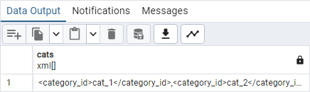
=== "XML[]"
    ```xml
    <category_id>cat_1</category_id>,
    <category_id>cat_2</category_id>
    ```

### Функция xpath_exists

Функция `xpath_exists` в PostgreSQL определяет, существуют ли элементы, соответствующие выражению `XPath`.

Результат её выполнения — значение `Boolean`, определяющее, будет ли возвращено какое-либо значение, кроме пустого набора узлов.

**Запрос**

```sql
SELECT 	xpath_exists('/collaborator/category_id', data) AS bcats
FROM 	dbo.collaborator
WHERE   id = 6148914691236517121;
```

**Результат**

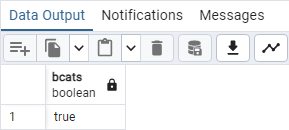

### Функция unnest

Функция `unnest()` в PostgreSQL принимает массив в качестве аргумента и расширяет данный массив в набор строк. Проще говоря, `unnest` преобразует массив в табличную структуру.

**Запрос**

```sql
SELECT 	unnest(xpath('/collaborator/category_id', data)) AS bcats
FROM 	dbo.collaborator
WHERE   id = 6148914691236517121;
```

**Результат**

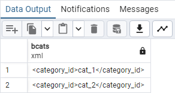

### Приведение типов

Для приведения типов используется конструкция `CAST (exp AS data_type)`

**Запрос**

```sql
SELECT CAST ('572' AS INTEGER);
```

**Результат**

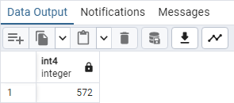

Чаще всего используется укороченный синтаксис приведения

**Запрос**

```sql
SELECT '572'::INTEGER;
```

**Результат**


## Сборник запросов

### Получаем первый XML узел по его имени

Найдем узел `lastname`

**Запрос**

```sql
SELECT 	 xpath('/collaborator/lastname[1]', data) AS lastname
		,xpath('/collaborator/lastname[2]', data) AS lastname
		,(xpath('/collaborator/lastname', data))[1] AS lastname
FROM 	dbo.collaborator
WHERE   id = 6148914691236517121;
```

**Результат**

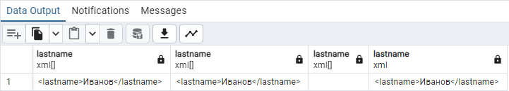

!!! info "Обратите внимание"
    Первый вариант вернет массив с узлом `lastname` с индексом 1
    Второй вариант вернет пустой массив, так как в документе не существует узел `lastname` с индексом 2
    Третий вариант возвращает первый узел `lastname` из массива найденных узлов `lastname`

### Получаем все XML узлы по имени

Найдем все узлы с именем `category_id`. Каждая категория, присвоенная сотруднику, находится в отдельном `<category_id>...</category_id>`

**Запрос**

```sql
SELECT 	xpath('/collaborator/category_id', data) AS cats
FROM 	dbo.collaborator
WHERE 	id = 6148914691236517121;
```

**Результат**

=== "pgAdmin"
    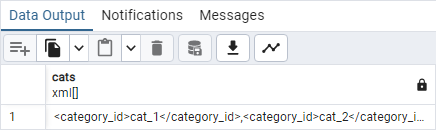

=== "XML[]"
    ```xml
    <category_id>cat_1</category_id>,
    <category_id>cat_2</category_id>
    ```

!!! info "Обратите внимание"
    `xpath` всегда возвращает массив найденных узлов

### Получаем XML узел со всем его содержимым

Найдем узлы кастомных полей с его родителем. Кастомные поля хранятся в узлах с именем `custom_elem`, корневой узел для которых `custom_elems`

**Запрос**

```sql
SELECT 	xpath('/collaborator/custom_elems', data) AS custom_elems
FROM 	dbo.collaborator
WHERE 	id = 6148914691236517121;
```

**Результат**

=== "pgAdmin"
    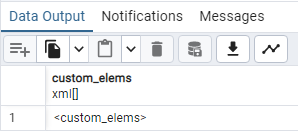
=== "XML[]"
    ```xml
    <custom_elems>
		<custom_elem>
			<name>f_nj0z</name>
		</custom_elem>
		<custom_elem>
			<name>field1</name>
			<value>0x61FD2936115CA629</value>
		</custom_elem>
		<custom_elem>
			<name>field2</name>
			<value>sdfsfsfsdfsf</value>
		</custom_elem>
		<custom_elem>
			<name>fld_doc</name>
			<value>0x61ADE372EBEAD381</value>
		</custom_elem>
		<custom_elem>
			<name>fld_relation</name>
			<value>0x61FD2D422FA94E42</value>
		</custom_elem>
		<custom_elem>
			<name>fld_city</name>
			<value>Киров</value>
		</custom_elem>
		<custom_elem>
			<name>fld_comment</name>
			<value>Что-то умеет делать</value>
		</custom_elem>
		<custom_elem>
			<name>fld_age</name>
			<value>36</value>
		</custom_elem>
		<custom_elem>
			<name>fld_weight</name>
			<value>74</value>
		</custom_elem>
		<custom_elem>
			<name>fld_birth_date</name>
			<value>1988-06-02T00:00:00</value>
		</custom_elem>
		<custom_elem>
			<name>fld_married</name>
			<value>true</value>
		</custom_elem>
		<custom_elem>
			<name>fld_sex</name>
			<value>М</value>
		</custom_elem>
		<custom_elem>
			<name>fld_skills</name>
			<value>Офис;Javascript</value>
		</custom_elem>
		<custom_elem>
			<name>skill_javascript</name>
			<value>true</value>
		</custom_elem>
		<custom_elem>
			<name>skill_PHP</name>
			<value>true</value>
		</custom_elem>
		<custom_elem>
			<name>skill_Docker</name>
			<value>true</value>
		</custom_elem>
		<custom_elem>
			<name>skill_Kerberos</name>
			<value>true</value>
		</custom_elem>
		<custom_elem>
			<name>skill_HTML</name>
			<value>true</value>
		</custom_elem>
		<custom_elem>
			<name>skill_WebTutor</name>
			<value>true</value>
		</custom_elem>
	</custom_elems>
    ```

### Получаем XML узел по его индексу

Найдем узел `custom_elem` по его индексу

**Запрос**

```sql
SELECT 	 xpath('/collaborator/custom_elems/custom_elem[6]', data) AS custom_elem
		,(xpath('/collaborator/custom_elems/custom_elem', data))[6] AS custom_elem
FROM 	dbo.collaborator
WHERE 	id = 6148914691236517121;
```

**Результат**

=== "pgAdmin"
    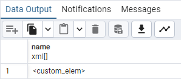
=== "XML[]"
    ```xml
    <custom_elem>
        <name>fld_city</name>
        <value>Киров</value>
    </custom_elem>
    ```
=== "XML"
    ```xml
    <custom_elem>
        <name>fld_city</name>
        <value>Киров</value>
    </custom_elem>
    ```

!!! info "Обратите внимание"
    В первом случае возвращается массив `xml`, во втором узел `xml`

### Получаем XML узел по значению его вложенного узла

Найдем узел `custom_elem` в котором содержится узел `name` со значением `fld_city`

**Запрос**

```sql
SELECT 	xpath('/collaborator/custom_elems/custom_elem[name="fld_city"]', data) AS custom_elem
FROM 	dbo.collaborator
WHERE 	id = 6148914691236517121;
```

**Результат**

=== "pgAdmin"
    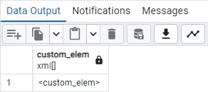
=== "XML[]"
    ```xml
    <custom_elem>
        <name>fld_city</name>
        <value>Киров</value>
    </custom_elem>
    ```

Конструкция `...custom_elem[name="fld_city"]...` ищет узел `custom_elem` в котором находится узел `name` со значением `fld_city` и возвращает массив подходящих узлов `custom_elem`

### Получаем XML узел по значению соседнего XML узла

Найдем узел `value`, который вложен в узел `custom_elem`, где так же вложен узел `name` со значением `fld_city`

**Запрос**

```sql
SELECT 	xpath('/collaborator/custom_elems/custom_elem[name="fld_city"]/value', data) AS custom_elem_city
FROM 	dbo.collaborator
WHERE 	id = 6148914691236517121;
```

**Результат**

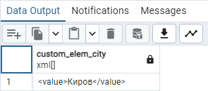

### Получаем значение XML узла

Найдем значения узлов с основными данными сотрудника (ИД, фамилию, дату рождения и флаг уволен сотрудник или нет) и приведем их к примитивным типам

**Запрос**

```sql
SELECT 	 (xpath('/collaborator/id/text()', data))[1]::TEXT::BIGINT AS id
        ,(xpath('/collaborator/lastname/text()', data))[1]::TEXT AS lastname
        ,(xpath('/collaborator/birth_date/text()', data))[1]::TEXT::DATE AS birth_date
        ,(xpath('/collaborator/is_dismiss/text()', data))[1]::TEXT::BOOLEAN AS is_dismiss
FROM 	dbo.collaborator
WHERE 	id = 6148914691236517121;
```

**Результат**

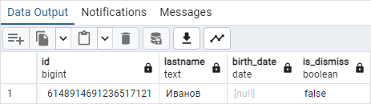

!!! warning "Обратите внимание"
    Если попытаться привести поле `lastname` к дате, то получим ошибку

    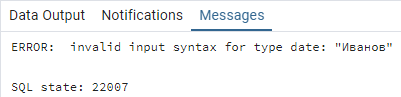

### Получаем значения кастомных полей

Найдем значения `value` кастомных полей с именами `fld_city`, `fld_birth_date` и `fld_skills`

**Запрос**

```sql
SELECT 	 (xpath('/collaborator/custom_elems/custom_elem[name="fld_city"]/value/text()', data))[1]::TEXT
        ,(xpath('/collaborator/custom_elems/custom_elem[name="fld_birth_date"]/value/text()', data))[1]::TEXT::TIMESTAMP
        ,(xpath('/collaborator/custom_elems/custom_elem[name="fld_skills"]/value/text()', data))[1]::TEXT
FROM 	dbo.collaborator
WHERE 	id = 6148914691236517121;
```

**Результат**


### Получаем значения дочерних узлов из массива родительских узлов

Найдем из списка состояний сотрудника `history_states` состояние `history_state`, поле `state_id` которого имеет значение `vacation`, и выведем значения узлов `start_date` и `finish_date` в формате даты

**Запрос**

```sql
SELECT 	 (xpath('/collaborator/history_states/history_state[state_id="vacation"]/start_date/text()', data))::TEXT[]::TIMESTAMP[]
        ,(xpath('/collaborator/history_states/history_state[state_id="vacation"]/finish_date/text()', data))::TEXT[]::TIMESTAMP[]
FROM 	dbo.collaborator
WHERE 	id = 6148914691236517121;
```

**Результат**

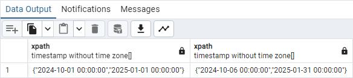

!!! warning "Обратите внимание"
    В карточке сотрудника существует 2 состояния с кодом `vacation`, а как мы уже знаем, `xpath` возвращает массив `xml`.  
    Сответственно и привидение типов тоже должно выполняться для массивов.

### Получаем последний дочерний XML узел

Когда количество узлов неизвестно, можно получить последний узел с помощью функции `last()`, предпоследний `last()-1` и т.д.

**Запрос**

```sql
SELECT 	 (xpath('/collaborator/custom_elems/custom_elem[last()]/name/text()', data))[1]::TEXT
		,(xpath('/collaborator/custom_elems/custom_elem[last()-1]/name/text()', data))[1]::TEXT
		,(xpath('/collaborator/custom_elems/custom_elem[last()-2]/name/text()', data))[1]::TEXT
FROM 	dbo.collaborator
WHERE 	id = 6148914691236517121;
```

**Результат**

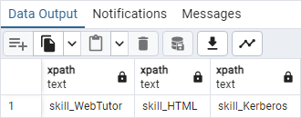

### Использование агрегации для значений XML узлов

У сотрудника есть 2 отпуска. В комментариях к состоянию хранится количество дней отпуска. Нам нужно получить количество отпусков и их сумму дней. Для этого применим 2 функции `count()` и `sum()`

**XML состояний сотрудника**

```xml
<history_states>
    <history_state>
        <id>y8gr8e</id>
        <state_id>vacation</state_id>
        <start_date>2024-10-01T00:00:00+00:00</start_date>
        <finish_date>2024-10-06T00:00:00+00:00</finish_date>
        <comment>6</comment>
    </history_state>
    <history_state>
        <id>7sgn58</id>
        <state_id>g5k8</state_id>
        <start_date>2024-09-01T00:00:00+00:00</start_date>
        <finish_date>2024-09-04T00:00:00+00:00</finish_date>
        <comment>4</comment>
    </history_state>
    <history_state>
        <id>mvchh6</id>
        <state_id>vacation</state_id>
        <start_date>2025-01-01T00:00:00+00:00</start_date>
        <finish_date>2025-01-31T00:00:00+00:00</finish_date>
        <comment>30</comment>
    </history_state>
</history_states>
```

**Запрос**

```sql
SELECT 	 (xpath('sum(/collaborator/history_states/history_state[state_id="vacation"]/comment/text())', data))[1]::TEXT::INTEGER AS sum
		,(xpath('count(/collaborator/history_states/history_state[state_id="vacation"]/comment/text())', data))[1]::TEXT::INTEGER AS count
FROM 	dbo.collaborator
WHERE 	id = 6148914691236517121;
```

**Результат**

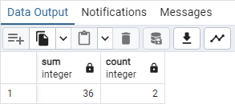

### Проверяем существование XML узла

Проверим наличие узла `password` и отдельно наличие значения узла `password`

**Запрос**

```sql
SELECT   CLS.login
		,xpath('/collaborator/password', CL.data) AS pwd
		,xpath_exists('/collaborator/password', CL.data) AS pwd_exist
		,xpath_exists('/collaborator/password/text()', CL.data) AS pwd_text_exist
FROM 	dbo.collaborators CLS INNER JOIN dbo.collaborator CL ON CLS.id = Cl.id
ORDER BY xpath_exists('/collaborator/password/text()', CL.data) ASC
```

**Результат**

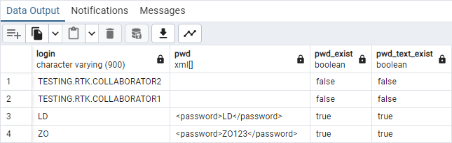

!!! info "Обратите внимание"
    Наличие узла `<password></password>` и наличие значения узла `<password>111</password>` будут обработаны по разному

    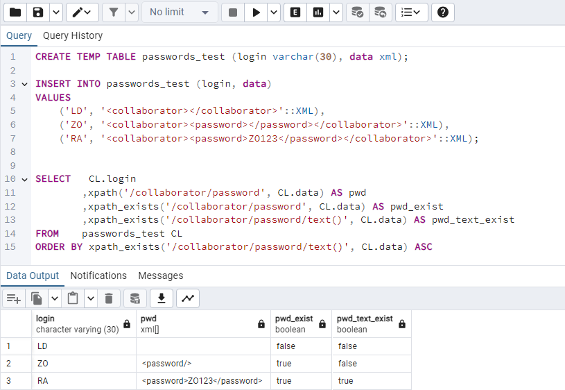

### Проверяем равенство значения XML узла с нашим значением

Найдем все строки с узлом `login` со значением `user1`

**Запрос**

```sql
SELECT 	 (xpath('/collaborator/login/text()', data))[1]::TEXT AS login
		,(xpath('/collaborator/login/text() = "user1"', data))[1]::TEXT::BOOLEAN AS login_xpath
		,xpath_exists('/collaborator/login[text() = "user1"]', data) AS login_xpath_exist
FROM 	dbo.collaborator
ORDER BY (xpath('/collaborator/login/text()', data))[1]::TEXT DESC
```

**Результат**

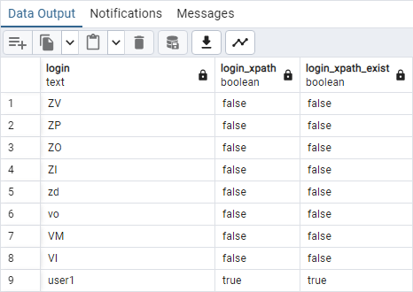

### Проверяем, содержит ли значение XML узла подстроку

Найдем всех сотрудников для которых пароль (узел `password`) содержит в значении `1234`

**Запрос**

```sql
SELECT 	 (xpath('/collaborator/login/text()', data))[1]::TEXT AS login
		,(xpath('/collaborator/password/text()', data))[1]::TEXT AS password
		,xpath_exists('(/collaborator/password/text()[contains(., "1234")])', data) AS password_1234
FROM 	dbo.collaborator
ORDER BY xpath_exists('(/collaborator/password/text()[contains(., "1234")])', data) DESC
```

**Результат**

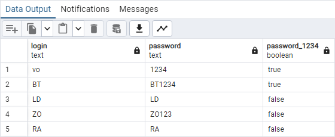

В примере используется дополнительная конструкция `[contains(., "1234")]`. Функция `contains(str, substr)` проверяет, содержит ли строка `str` подстроку `substr`. Оператор `.` - возвращает все найденное содержимое предшествующему запросу `XPath` - значение элемента `password`.

### Проверяем значение кастомного поля в WebTutor

Найдем все записи, где узел `custom_elem` содержит узел `name` со значением `fld_city` и узел `value` со значением `Киров`

**Запрос**

```sql
SELECT   (xpath('/collaborator/login/text()', data))[1]::TEXT AS login
		,(xpath('/collaborator/custom_elems/custom_elem[name = "fld_city"]/value/text()', data))[1]::TEXT
		,xpath_exists('/collaborator/custom_elems/custom_elem[name = "fld_city" and value = "Киров"]', data)
FROM	dbo.collaborator
WHERE	xpath_exists('/collaborator/custom_elems/custom_elem[name = "fld_city"]/value/text()', data)
```

**Результат**

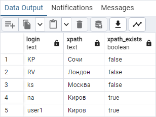

### Разделяем по разным строкам каждый найденный XML узел

Для каждого имеющегося узла `custom_elem` в документе, выведем значения его дочерних элементов.

**Запрос**

```sql
SELECT	 (xpath('/collaborator/lastname/text()', CL.data))[1]::TEXT
		,(xpath('/custom_elem/name/text()', cstm))[1]::TEXT AS name
		,(xpath('/custom_elem/value/text()', cstm))[1]::TEXT AS value
FROM	dbo.collaborator CL
		CROSS JOIN unnest(xpath('/collaborator/custom_elems/custom_elem', data)) cstm
WHERE	id = 6148914691236517121;
```

**Результат**

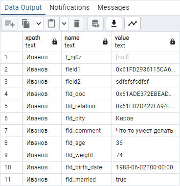

В данном примере функция `unnest` принимает на вход результат выражения `XPath`, который в свою очередь всегда возвращает массив XML, и возвращает табличное представление каждого отдельного `XML`, к которому мы снова можем обращаться через `xpath`.

### Получаем порядковые номера XML узлов на одном уровне

Для функции `unnest` можно указать опцию `WITH ORDINALITY`, которая добавит к результату функции ещё один столбец с типом `bigint`. В этом столбце нумеруются строки результирующего набора, начиная с 1. Так же можно использовать оконные функции.

**Запрос**

```sql
SELECT	 (xpath('/collaborator/lastname/text()', CL.data))[1]::TEXT
		,(xpath('/custom_elem/name/text()', CLD.cstm))[1]::TEXT AS name
		,(xpath('*/value/text()', CLD.cstm))[1]::TEXT AS value
		,CLD.idx AS node_number
		,ROW_NUMBER() OVER (PARTITION BY CL.id ORDER BY CL.id) AS node_number_wf
FROM	dbo.collaborator CL
		CROSS JOIN unnest(xpath('/collaborator/custom_elems/custom_elem', data)) with ordinality CLD(cstm, idx)
WHERE	id = 6148914691236517121;
```

**Результат**

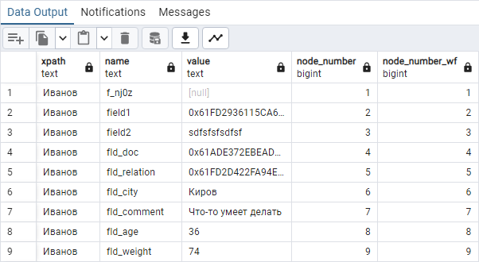

### Собираем значения нескольких полей в одном поле по ключу

Предположим, что у нас есть таблица, где на каждого сотрудника хранятся номера его телефонов

**Данные:**

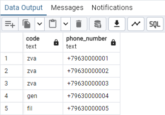

**Запрос:**

```sql
SELECT	 code
		,STRING_AGG(phone_number, ', ')
FROM	phones
GROUP BY code
```

**Результат:** 

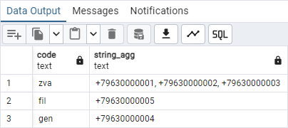

### Получение полной иерархии подразделений

**Документ:**

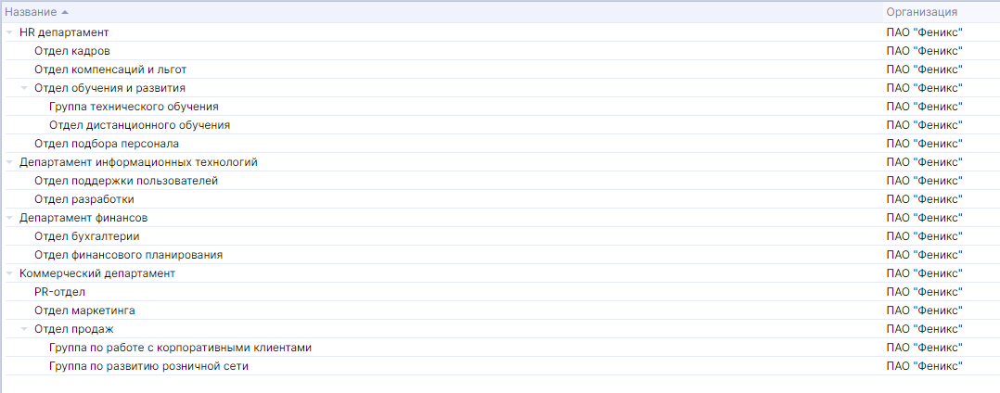

**Запрос:**

```sql
WITH RECURSIVE tree (id, name, arr, level) AS 
(
	SELECT	 id
			,name
			,ARRAY[name::TEXT]
			,0 AS level
	FROM	dbo.subdivisions
	WHERE	parent_object_id IS NULL

	UNION ALL

	SELECT 	 S.id
			,S.name
			,array_append(arr, S.name::TEXT)
			,level + 1
	FROM	tree T INNER JOIN dbo.subdivisions S ON T.id = S.parent_object_id
)

SELECT	 id
		,array_to_string(arr, ' >> ') AS path
		,arr[1] AS top_level
		,arr[array_length(arr, 1)] AS bottom_level -- "1" - число, указывающее на измерение, для которого нужно найти длину. Для одномерного массива это значение обычно равно 1
		,level
FROM	tree
```

**Результат:**

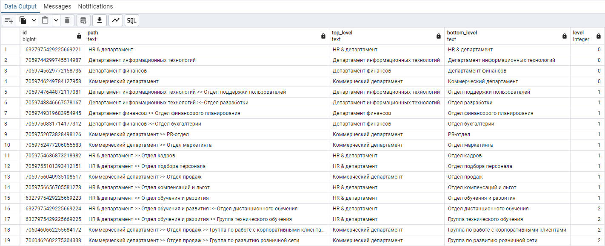

### Получаем список подразделений по иерархии вверх, включая само подразделение

**Документ:**


**Запрос:**

```sql
WITH RECURSIVE tree AS (
	SELECT	id, name, parent_object_id, 1 AS level
	FROM	dbo.subdivisions
	WHERE	id = 7060462602275304338

	UNION ALL

	SELECT	S.id, S.name, S.parent_object_id, level + 1
	FROM	dbo.subdivisions S INNER JOIN tree T ON S.id = T.parent_object_id
)

SELECT	*
		,(string_to_array(reverse(array_to_string((SELECT array_agg(level) FROM tree), ',')), ','))[level]::INTEGER AS level_reverse
		,(array_length((SELECT array_agg(level) FROM tree), 1) - level + 1) AS level_reverse
FROM	tree
```

**Результат:**

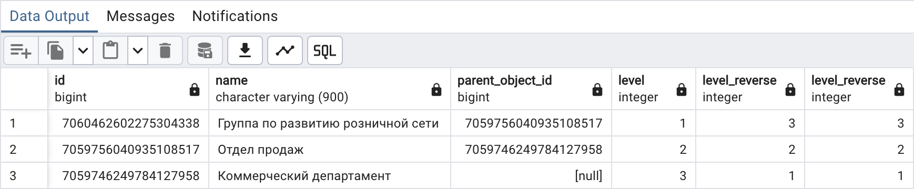

### Получаем значения XML узлов и собираем в строку через разделитель

**Документ**

Кастомные поля в админке

=== "Кастомные поля в админке"
    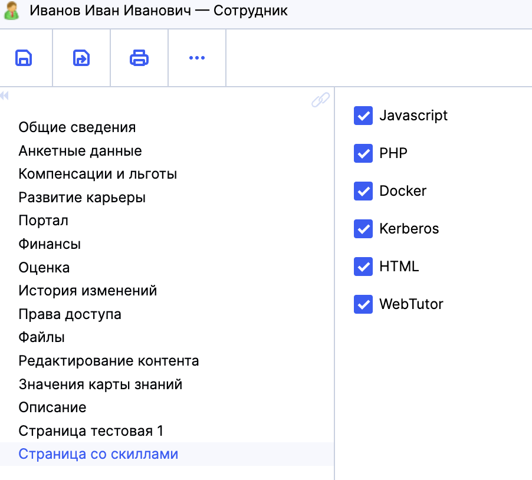
=== "Кастомные поля в XML"
    ```xml
    <custom_elems>
        <custom_elem>
            <name>skill_javascript</name>
            <value>true</value>
        </custom_elem>
        <custom_elem>
            <name>skill_PHP</name>
            <value>true</value>
        </custom_elem>
        <custom_elem>
            <name>skill_Docker</name>
            <value>true</value>
        </custom_elem>
        <custom_elem>
            <name>skill_Kerberos</name>
            <value>true</value>
        </custom_elem>
        <custom_elem>
            <name>skill_HTML</name>
            <value>true</value>
        </custom_elem>
        <custom_elem>
            <name>skill_WebTutor</name>
            <value>true</value>
        </custom_elem>
    </custom_elems>
    ```

Наша задача - собрать для каждого сотрудника указанные скиллы.

**Запрос:**

```sql
SELECT	 CLS.fullname
		,array_to_string(
			xpath('/collaborator/custom_elems/custom_elem[contains(.,"skill_") and value = true()]/name/text()', CL.data)::TEXT[],
			', '
		)
FROM	dbo.collaborators CLS
		INNER JOIN dbo.collaborator CL ON CLS.id = CL.id
WHERE	xpath_exists('/collaborator/custom_elems/custom_elem[contains(.,"skill_") and value = true()]/name/text()', CL.data)
```

**Результат**

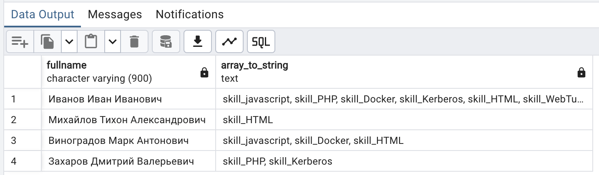

Если хотим получить не значения полей, а их названия

**Запрос:**

```sql
WITH custom_template AS (
	SELECT	 (xpath('/field/name/text()', fld))[1]::TEXT AS name
			,(xpath('/field/title/text()', fld))[1]::TEXT AS title
	from	dbo."(spxml_blobs)"
			CROSS JOIN unnest(xpath('/custom_templates/collaborator/fields/field', convert_from(data, 'UTF-8')::XML)) fld
	where	url = 'x-local://wt_data/lists/wtv_custom_templates.xml'
)
,skills AS (
	SELECT	 CLS.fullname
			,CLS.id
			,unnest(
				xpath('/collaborator/custom_elems/custom_elem[contains(.,"skill_") and value = true()]/name/text()', CL.data)::TEXT[]
			) AS skill
	FROM	dbo.collaborators CLS
			INNER JOIN dbo.collaborator CL ON CLS.id = CL.id
	WHERE	xpath_exists('/collaborator/custom_elems/custom_elem[contains(.,"skill_") and value = true()]/name/text()', CL.data)
)

SELECT	 S.fullname
		,string_agg(C.title, ', ')
FROM	skills S INNER JOIN custom_template C ON S.skill = C.name
GROUP BY S.id, S.fullname
```

**Результат**

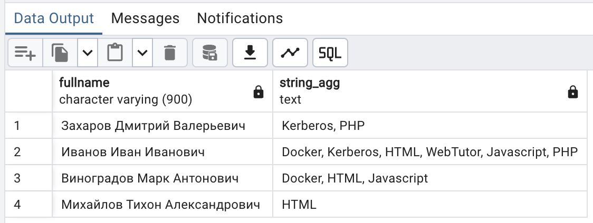