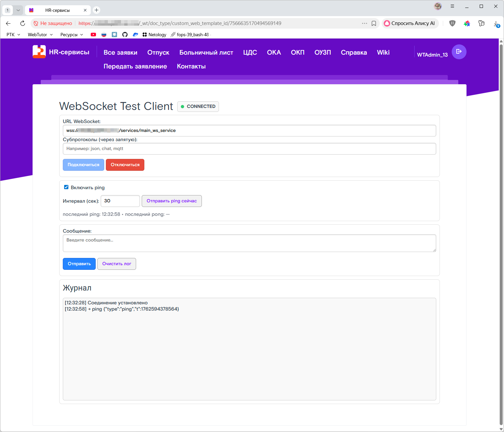
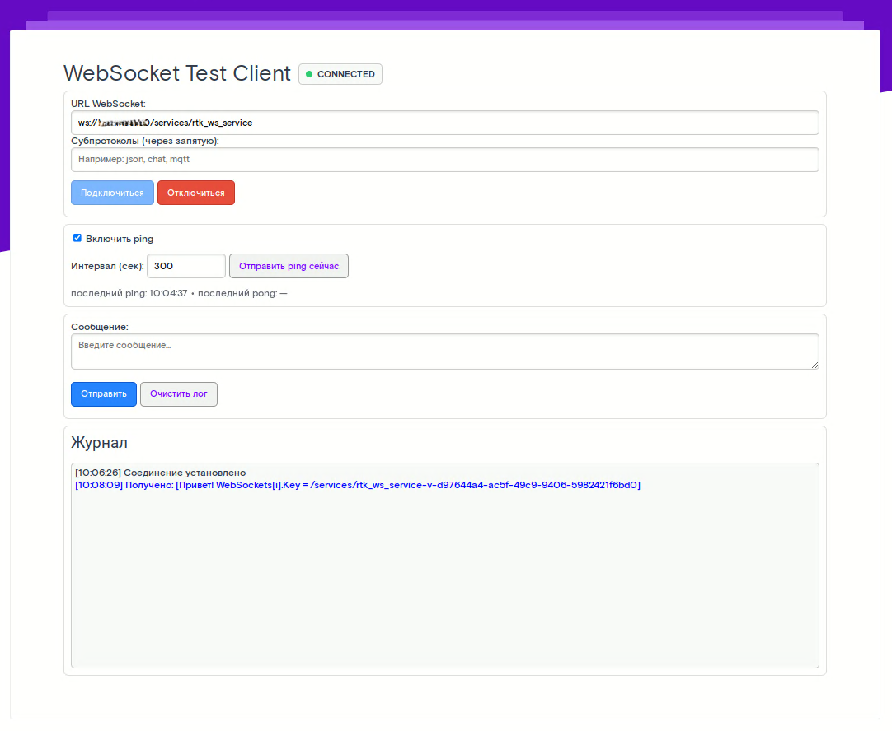
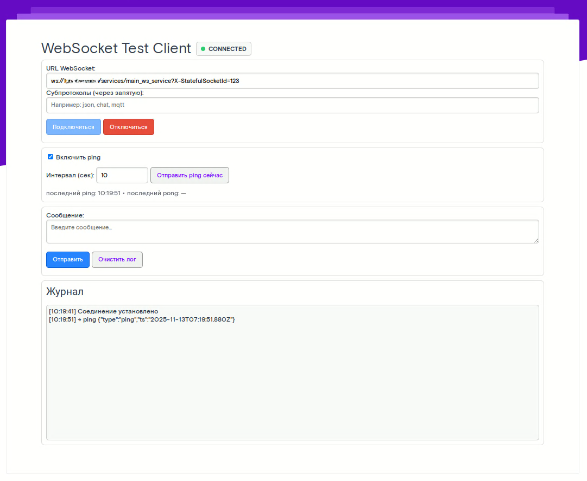
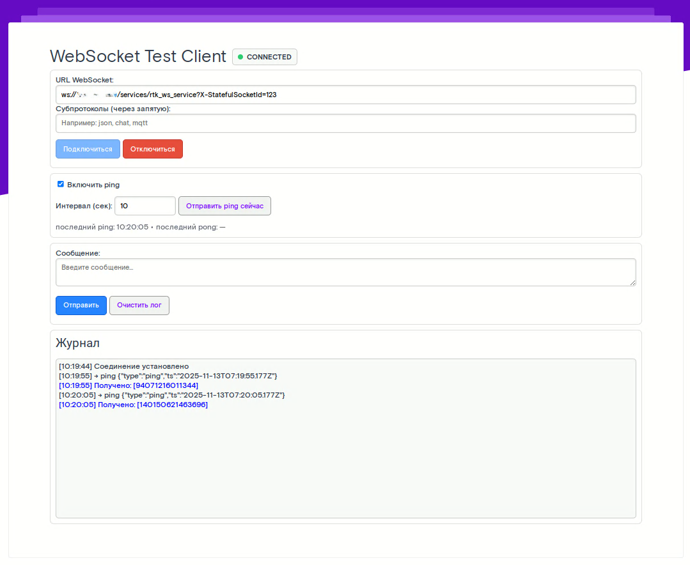
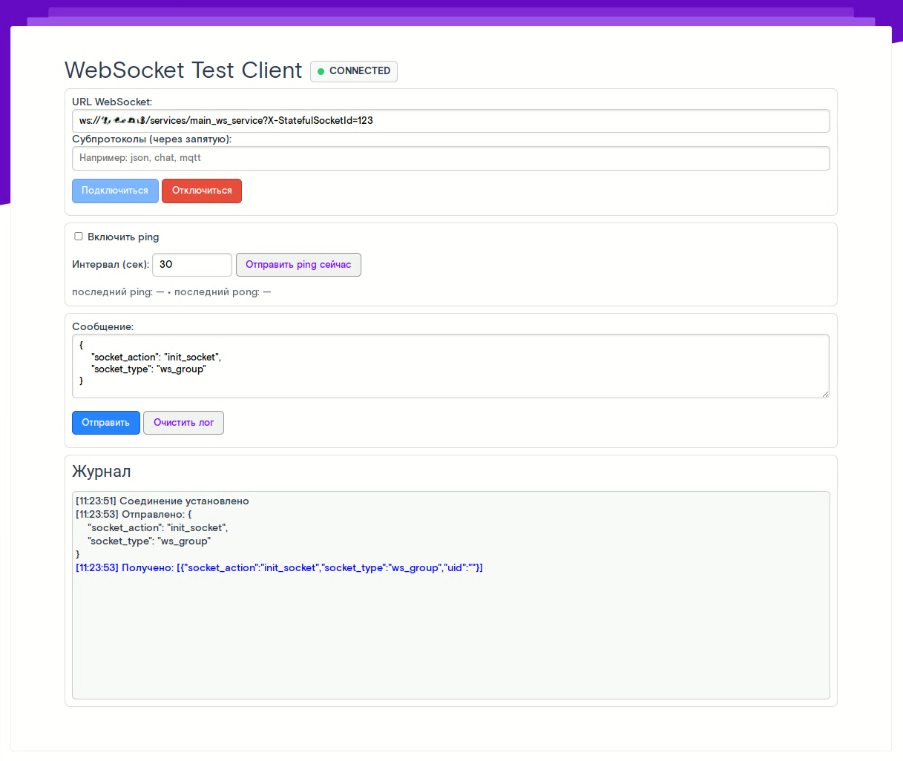
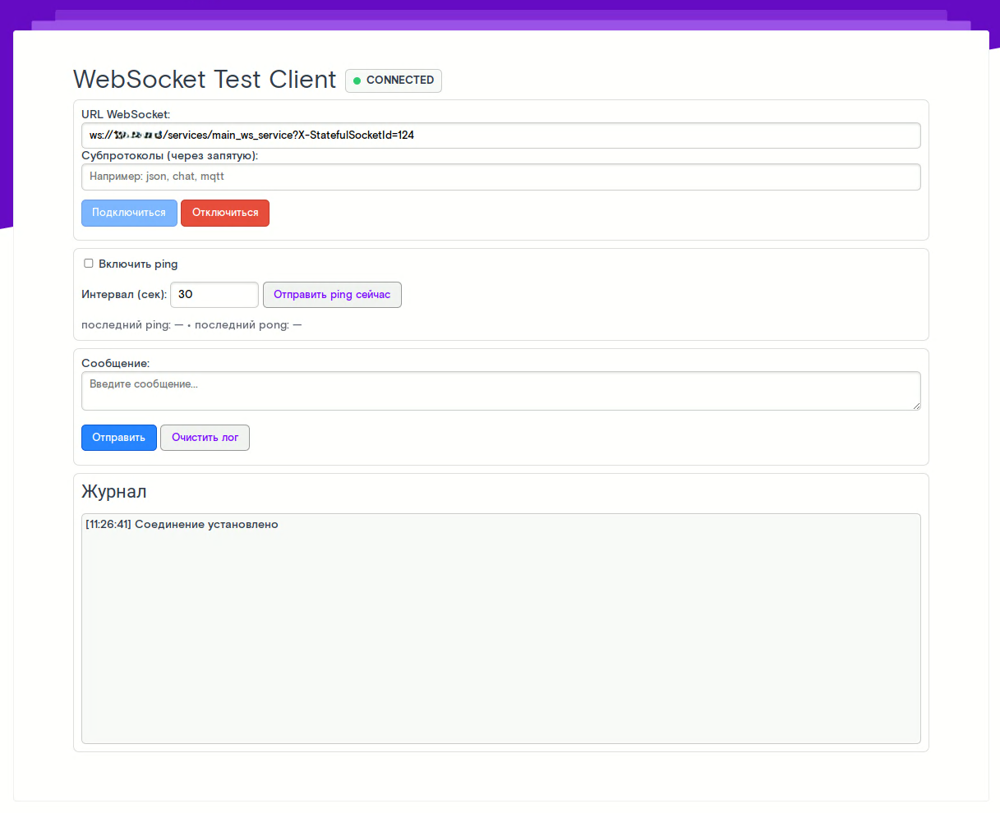
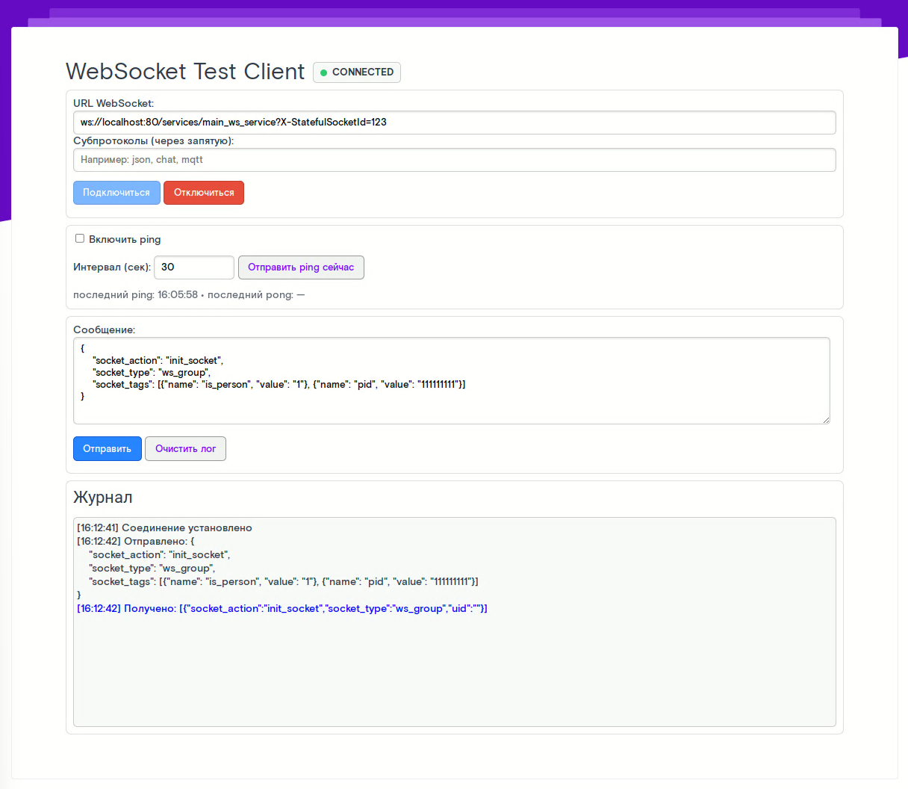
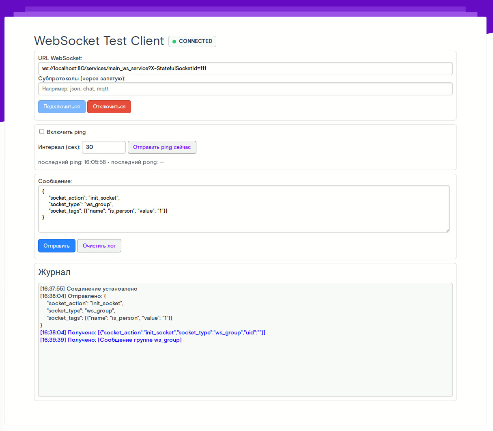
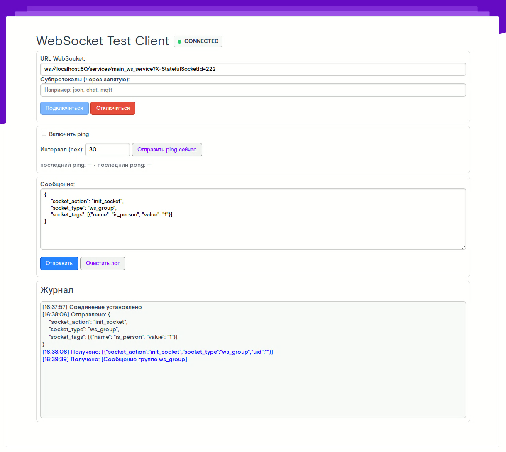

# WebSocket'ы в WebTutor


## Подготовка

Для тестирования WebSocket на клиенте будем использовать сгенерированную ИИ [HTML страницу] (./ws-client.html).


## Первое подключение

Заходим на страницу тестирования, вводим в строку `URL WebSocket` адрес нашего DEV-сервера и жмем кнопку подключиться. При успешном подключении видим зеленый статус `🟢 CONNECTED`



!!! warning "Важно"
	Для подключения по `wss` необходим протокол `HTTPS`, для подключения по `ws` - `HTTP`. Если на DEV сервере нет сертификата, то для подключения используем `ws`, на проде используем `wss`


## Первое сообщение

Для отправки сообщений на клиент можно использовать любой серверный код. Для примера создадим агент и запустим его на сервере:

``` javascript
// Получаем доступ к сборке .NET
xHttpStaticAssembly = tools.get_object_assembly( 'XHTTPMiddlewareStatic' ); 

// Получаем список всех сокетов
WebSockets = xHttpStaticAssembly.CallClassStaticMethod( 'Datex.XHTTP.WebSocketContext', 'GetWebSockets').ToArray(); 

// Рассылаем сообщение каждому клиенту
for(i = 0; i < WebSockets.length; i++) { 
    xHttpStaticAssembly.CallClassStaticMethod( 
        'Datex.XHTTP.WebSocketContext', 
        'WriteToWebSocketMessageQueue', 
        [
            WebSockets[i].Key,
            'Привет! WebSockets[i].Key = ' + WebSockets[i].Key,
            true
        ] 
    ); 
}
```

`get_object_assembly` — это функция WebTutor, которая загружает .NET-сборку (Datex.XHTTP.dll) и возвращает объект-обёртку, позволяющий вызывать статические методы классов внутри неё.

`GetWebSockets()` — это статический метод из Datex.XHTTP.WebSocketContext, который возвращает коллекцию `IEnumerable<KeyValuePair<string, WebSocket>>`, где:

* `Key` — строковый идентификатор соединения (socketId), уникальный для каждого клиента

* `Value` — объект System.Net.WebSockets.WebSocket, сам сокет клиента

`.ToArray()` просто делает из этого перечисления массив, чтобы удобно было итерироваться в цикле.

`WriteToWebSocketMessageQueue` это статический метод, который кладёт сообщение в очередь исходящих сообщений для конкретного сокета. Сообщения из этой очереди потом отправляются асинхронно внутренним обработчиком WebSocketContext. Параметры:

* `socketId` - идентификатор WebSocket-соединения (тот самый WebSockets[i].Key)

* `message` - текст сообщения, который будет отправлен клиенту

* `json_compound` - флаг, указывающий, нужно ли упаковывать сообщение как JSON (или просто отправить строку)


На клиенте должны увидеть сообщение от сервера

{==*ответ с json_compound = true*==}


{==*ответ с json_compound = false*==}


!!! warning "Важно"
	В этом примере отправка сообщений будет происходить всем клиентам с установленным соединением `WebSocket`, в том числе, тем, кто подключен к другим сервисам `WebSocket`

    Для примера создам копию сервиса `main_ws_service` - `rtk_ws_service`, и запустим агент повторно. На каждом подключении получаем сообщение:

    

    


## Отправка конкретному клиенту

В предудущем примере, при подключении к `WebSocket`, нам присваивался случайный `socketId` `main_ws_service-<v-...>`

Чтобы указать нужный нам идентификатор, используется `GET` параметр `X-StatefulSocketId`. Этот параметр присваивает нашему соединению указанный идентификатор. Если повторно подключиться и указать тот же `X-StatefulSocketId`, сервер узнает тебя и свяжет новое соединение с тем же состоянием. 

Получим наш `socketId` и вернем его клиенту:
``` javascript
xHttpStaticAssembly = tools.get_object_assembly( 'XHTTPMiddlewareStatic' ); 
WebSockets = xHttpStaticAssembly.CallClassStaticMethod( 'Datex.XHTTP.WebSocketContext', 'GetWebSockets').ToArray(); 

for(i = 0; i < WebSockets.length; i++) { 
    xHttpStaticAssembly.CallClassStaticMethod( 
        'Datex.XHTTP.WebSocketContext', 
        'WriteToWebSocketMessageQueue', 
        [
            WebSockets[i].Key,
            'Наш socketId  = ' + WebSockets[i].Key,
            true
        ]
    ); 
}
```

{==*видим в сообщении наш socketId*==}


Теперь мы знаем, как определить нужное соединение, отправим сообщение нужному клиенту. Для проверки откроем несколько соединений, один без указания `socketId`, другой с указанием `socketId` и отправим 2 сообщения: общее и только нужному подключению.

``` javascript
// Получаем доступ к сборке .NET
xHttpStaticAssembly = tools.get_object_assembly( 'XHTTPMiddlewareStatic' ); 

// Получаем список всех подключённых клиентов
WebSockets = xHttpStaticAssembly.CallClassStaticMethod( 'Datex.XHTTP.WebSocketContext', 'GetWebSockets').ToArray(); 

// Рассылаем сообщение каждому клиенту
for(i = 0; i < WebSockets.length; i++) { 
    socketId = WebSockets[i].Key
    xHttpStaticAssembly.CallClassStaticMethod( 
        'Datex.XHTTP.WebSocketContext', 
        'WriteToWebSocketMessageQueue', 
        [
            socketId,
            'Общее сообщение на socketId ' + WebSockets[i].Key,
            false
        ]
    ); 

    if (!StrEnds(socketId, 's-123', true)) continue
    xHttpStaticAssembly.CallClassStaticMethod( 
        'Datex.XHTTP.WebSocketContext', 
        'WriteToWebSocketMessageQueue', 
        [
            socketId,
            'Личное сообщение на socketId' + WebSockets[i].Key,
            false
        ]
    ); 
}
```

{==*клиент без socketId*==}


{==*клиент с socketId*==}


!!! warning "Важно"
	Уникальность `X-StatefulSocketId` должна обеспечиваться в рамках отдельного сервиса. Для примера возьмем 2 сервиса `main_ws_service` и `rtk_ws_service`, и укажем для подключения одинковый `X-StatefulSocketId`

    

    

    Видим, что подключения создались и находятся в активном состоянии


## Отправка группе клиентов


### Вариант при первом подключении к сервису

Сервис `main_ws_service` принимает только один параметр `X-StatefulSocketId`, по-этому, один из способов отправить определенной группе - зашифровать группу в параметре `X-StatefulSocketId` при подключении :)

Сделаем 4 разных подключения:

* `wss://domen.ru/services/main_ws_service?X-StatefulSocketId=id:10001::group_id:10001`
* `wss://domen.ru/services/main_ws_service?X-StatefulSocketId=id:10002::group_id:10001`
* `wss://domen.ru/services/main_ws_service?X-StatefulSocketId=id:10003::group_id:10002`
* `wss://domen.ru/services/main_ws_service?X-StatefulSocketId=id:10004::group_id:10002`


Для отправки группе `10002` запустим код

``` javascript
// Получаем доступ к сборке .NET
xHttpStaticAssembly = tools.get_object_assembly( 'XHTTPMiddlewareStatic' ); 

// Получаем список всех подключённых клиентов
WebSockets = xHttpStaticAssembly.CallClassStaticMethod( 'Datex.XHTTP.WebSocketContext', 'GetWebSockets').ToArray(); 

// Рассылаем сообщение каждому клиенту
for(i = 0; i < WebSockets.length; i++) { 
    socketId = WebSockets[i].Key
    data = socketId.split('-s-')[1]
    params_str = data.split('::')
    params = {}
    for (param_str in params_str) {
        values = param_str.split(':')
        params.SetProperty(values[0], values[1])
    }
    
    xHttpStaticAssembly.CallClassStaticMethod( 
        'Datex.XHTTP.WebSocketContext', 
        'WriteToWebSocketMessageQueue', 
        [
            socketId,
            'Общее сообщение на socketId ' + tools.object_to_text(params, 'json'),
            false
        ]
    ); 

    if (params.GetOptProperty('group_id') == '10002') {
        xHttpStaticAssembly.CallClassStaticMethod( 
            'Datex.XHTTP.WebSocketContext', 
            'WriteToWebSocketMessageQueue', 
            [
                socketId,
                'Групповое сообщение группе ' + params.GetOptProperty('group_id'),
                false
            ]
        ); 
    }
}
```

{==*группа 10001*==}


{==*группа 10001*==}


{==*группа 10002*==}


{==*группа 10002*==}


### Вариант через специальное сообщение сервису

Еще один способ отправить сообщение группе или нескольким группам - использовать возможности сервиса `main_ws_service`, который при получении собщения вызывает функцию `main_socket` библиотеки `libMain`

!!! danger "ВНИМАНИЕ"
    Опыты проводились на 2 версиях WebTutor `WebSoft HCM Server  2022.1.3.434` и `WebSoft HCM Server  2023.2.906`.  
    В этих версиях отличается сама библиотека `Datex.XHTTP` и соответственно изменена функция `main_socket` библиотеки `libMain`.  
    Версия `Datex.XHTTP` в `WebSoft HCM Server  2022.1.3.434` **1.22.10.29**  
    Версия `Datex.XHTTP` в `WebSoft HCM Server  2022.1.3.906` **1.24.4.27**  


#### Вариант для 1.22.10.29

При отправке сообщения на сервер, вызывается функция `process`, которая парсит наше сообщение и отправляет в функцию `main_socket` библиотеки `libMain`

``` javascript
// wtv/wtv_main_ws_service.js

function process( context ) {
    // ... код

    oMessage = ParseJson( message );
    xHttpStaticAssembly = tools.get_object_assembly( 'XHTTPMiddlewareStatic' );
    oRes = tools.call_code_library_method( 'libMain', 'main_socket', [ Request, null, Request.Session, oMessage, RValue( context.WebSocketCurrentId ) ] );

    // ... код
}
```

!!! warning "ВАЖНО"
	В `Datex.XHTTP.WebSocketContext` отправка сообщения на сервер всегда жёстко идёт с `WebSocketMessageType.Text`, то есть принимает сообщения только в виде текста.

Функция вычисляет параметры JSON сообщения и выполняет какие либо действия. JSON может содержать следующие поля:

* `socket_action` - действие для выполнения. может принимать следующие знаечния:
    * `init_socket` - регистрирует текущий сокет пользователя в списке «подписчиков» для выбранного `socket_type`
    * `close_socket` - отписывает сокет из того же списка «подписчиков»
    * `call_method` - дополнительно считывает поля `library` и `method` и динамически вызывает какую-либо функцию библиотеки через `tools.call_code_library_method( sLibrary, sMethod, [ curUserID, sWebsocketID, sAction ] )`
    * `default (прочие действия)` - дейсвтия для прокторинга и чатов.
* `socket_type` - наш уникальный тип подключения, используется для получения ключа хранилища: <socket_type> + "_recipients";
* `library` - код бибилиотеки программного кода, используется при `socket_action == call_method`
* `method` - метод библиотеки, используется при `socket_action == call_method`

Чтобы отнести подключение к нужной нам группе, мы отправим в WebSocket следующее сообщение:

``` json
{
    "socket_action": "init_socket",
    "socket_type": "ws_group"
}
```

* `WebSocket` вызовет функцию `main_socket`
* будет создан ключ хранилища `sUserDataKey` со знаечнием `ws_group_recipients`
* наше подключение добавится в массив `result` объекта хранилища
* объект сохранится в хранилище `tools_web.set_user_data( sUserDataKey, { result: aRecipients }, 86400 );`



Запустим агент с кодом

``` javascript
res = tools_web.get_user_data("ws_group_recipients")
alert(tools.object_to_text(res, "json"))
```

И в логах увидим результат

```
11:24:04 [0115]	{"result":[{"person_id":"7177256154427237596","socket_id":"/services/main_ws_service-s-123"}]}
```

Для проверки создадим еще одно простое подключение


Теперь запустим агент, который будет отправлять сообщения нашей  группе подключений

``` javascript
// Получим группу сокетов
try {
    ws_group_data = tools_web.get_user_data("ws_group_recipients")
    ws_group_sockets = ws_group_data.GetOptProperty("result", [])
} catch (err) {
    ws_group_sockets = []
}

// Отправим сообщения активным сокетам
var xHttpStaticAssembly = tools.get_object_assembly( 'XHTTPMiddlewareStatic' );
for (socket in ws_group_sockets) {
    xHttpStaticAssembly.CallClassStaticMethod(
        'Datex.XHTTP.WebSocketContext',
        'WriteToWebSocketMessageQueue',
        [ socket.socket_id, 'Сообщение группе ws_group', false ]);
}
```

Убедимся, что сообщение пришло только тому сокету, который мы добавили в группу





#### Вариант для 1.24.4.27

При отправке сообщения на сервер, вызывается функция `process`, которая парсит наше сообщение и отправляет в функцию `main_socket` библиотеки `libMain`

``` javascript
// wtv/wtv_main_ws_service.js

function process( context ) {
    // ... код

    oMessage = ParseJson( message );
    xHttpStaticAssembly = tools.get_object_assembly( 'XHTTPMiddlewareStatic' );
    oRes = tools.call_code_library_method( 'libMain', 'main_socket', [ Request, null, Request.Session, oMessage, RValue( context.WebSocketCurrentId ) ] );

    // ... код
}
```

!!! warning "ВАЖНО"
	В `Datex.XHTTP.WebSocketContext` отправка сообщения на сервер всегда жёстко идёт с `WebSocketMessageType.Text`, то есть принимает сообщения только в виде текста.

Функция вычисляет параметры JSON сообщения и выполняет какие либо действия. JSON может содержать следующие поля:

* `socket_action` - действие для выполнения. может принимать следующие знаечния:
    * `init_socket` - регистрирует текущий сокет пользователя в списке «подписчиков» для выбранного `socket_type`
    * `close_socket` - ничего не делает
    * `call_method` - дополнительно считывает поля `library` и `method` и динамически вызывает какую-либо функцию библиотеки через `tools.call_code_library_method( sLibrary, sMethod, [ curUserID, sWebsocketID, sAction ] )`
    * `default (прочие действия)` - дейсвтия для прокторинга и чатов.
* `socket_type` - наш уникальный тип подключения, используется для получения ключа хранилища: <socket_type> + "_recipients";
* `socket_tags` - массив дополнительных тэгов, которые будут присвоены текущему сокету. Каждый объект массива должен иметь следующие поля:
    * `name` - будет превращен в название тэга
    * `value` - будет превращено в значение тэга
* `library` - код бибилиотеки программного кода, используется при `socket_action == call_method`
* `method` - метод библиотеки, используется при `socket_action == call_method`

Создадим новое подключение WebSocket и отправим сообщение серверу для добавления нашему сокету тэгов

``` json
{
    "socket_action": "init_socket",
    "socket_type": "ws_group",
    "socket_tags": [{"name": "is_person", "value": "1"}, {"name": "pid", "value": "111111111"}]
}
```



* `WebSocket` вызовет функцию `main_socket`
* будет создан объект с тэгами по умолчанию: `user_id`, `socket_type`, `pong`
* тэги, которые мы передали в `socket_tags` будут добавлены как новые свойства в объект `<name>: <value>`
* объект с тегами добавится к нашему сокету `context.WebSocketCurrent.SetTagsFromJson( EncodeJson( oTag ) );`

Запустим агент с кодом, который выведет все тэги для всех подключений

``` javascript
var xHttpStaticAssembly = tools.get_object_assembly( 'XHTTPMiddlewareStatic' );
var arrWebSockets = xHttpStaticAssembly.CallClassStaticMethod('Datex.XHTTP.WebSocketContext', 'GetWebSockets').ToArray();

for( socket in arrWebSockets ) {
    alert(socket.Key)
    for (tag in socket.Value.Tags) {
        alert(tag.Key + ": " + tag.Value)
    }
}
```

и получим в логах следующий вывод:

```
16:14:11 [0282] /services/main_ws_service-s-123
16:14:11 [0282] pid: 111111111
16:14:11 [0282] socket_type: ws_group
16:14:11 [0282] is_person: 1
16:14:11 [0282] pong: 1
16:14:11 [0282] user_id: 6148914691236517121
```


##### Получаем нужные сокеты через цикл

Чтобы отправить сообщение подключениям с нужным тэгом, можно в лоб их отфильровать: 

``` javascript
var xHttpStaticAssembly = tools.get_object_assembly( 'XHTTPMiddlewareStatic' );
var arrWebSockets = xHttpStaticAssembly.CallClassStaticMethod('Datex.XHTTP.WebSocketContext', 'GetWebSockets').ToArray();

for( socket in arrWebSockets ) {
    alert(socket.Key)
    for (tag in socket.Value.Tags) {
        // Можно использовать ArrayOptFind(socket.Value.Tags, "This.Key=='socket_type' && This.Value=='ws_group'")
        if (tag.Key == "socket_type" && tag.Value == "ws_group") {
            xHttpStaticAssembly.CallClassStaticMethod(
                'Datex.XHTTP.WebSocketContext',
                'WriteToWebSocketMessageQueue',
                [ socket.Key, 'Сообщение группе ws_group', false ]);
        }
    }
}
```


##### Получаем нужные сокеты через фильтр GetWebSockets

Но есть и другой вариант, использовать встроенную фильтрацию для `GetWebSockets`

Создадим 3 подключения:

* `ws://localhost:80/services/main_ws_service?X-StatefulSocketId=111`
* `ws://localhost:80/services/main_ws_service?X-StatefulSocketId=222`
* `ws://localhost:80/services/main_ws_service?X-StatefulSocketId=333`

Для первых двух отправим сообщение на сервер 

``` json
{
    "socket_action": "init_socket",
    "socket_type": "ws_group",
    "socket_tags": [{"name": "is_person", "value": "1"}]
}
```

Запустим агент для отправки уведомлений певрым двум подключениям

``` javascript
var xHttpStaticAssembly = tools.get_object_assembly( 'XHTTPMiddlewareStatic' );
var arrWebSockets = xHttpStaticAssembly.CallClassStaticMethod(
    'Datex.XHTTP.WebSocketContext', 
    'GetWebSockets',
    ["$socket_type:ws_group", true]
).ToArray();

for( socket in arrWebSockets ) {
    alert(socket.Key)
    xHttpStaticAssembly.CallClassStaticMethod(
        'Datex.XHTTP.WebSocketContext',
        'WriteToWebSocketMessageQueue',
        [ socket.Key, 'Сообщение группе ws_group', false ]);
}
```

Проверяем правильную отправку






## Заметки

### GetTag

``` javascript
var xHttpStaticAssembly = tools.get_object_assembly( 'XHTTPMiddlewareStatic' );
var arrWebSockets = xHttpStaticAssembly.CallClassStaticMethod(
    'Datex.XHTTP.WebSocketContext', 
    'GetWebSockets'
).ToArray();

for( socket in arrWebSockets ) {
    // Получаем значение тэга по имени
    socket_type = socket.Value.GetTag("socket_type")
    alert(socket_type)
}
```

### RemoveTag

``` javascript
var xHttpStaticAssembly = tools.get_object_assembly( 'XHTTPMiddlewareStatic' );
var arrWebSockets = xHttpStaticAssembly.CallClassStaticMethod(
    'Datex.XHTTP.WebSocketContext', 
    'GetWebSockets'
).ToArray();

for( socket in arrWebSockets ) {
    for (tag in socket.Value.Tags) {
        alert(tag.Key + ": " + tag.Value)
    }

    // Удаляем тэг
    socket.Value.RemoveTag("socket_type")
    
    for (tag in socket.Value.Tags) {
        alert(tag.Key + ": " + tag.Value)
    }
}
```

### SetTagsFromJson

``` javascript
var xHttpStaticAssembly = tools.get_object_assembly( 'XHTTPMiddlewareStatic' );
var arrWebSockets = xHttpStaticAssembly.CallClassStaticMethod(
    'Datex.XHTTP.WebSocketContext', 
    'GetWebSockets'
).ToArray();

for( socket in arrWebSockets ) {
    for (tag in socket.Value.Tags) {
        alert(tag.Key + ": " + tag.Value)
    }

    var oNewTags = new Object();
    oNewTags.webinar_id = 123;
    oNewTags.role = "speaker";
    oNewTags.socket_type = "ws_group_replace"

    // Преобразуем в JSON и заменяем тэги. Старые тэги удаляются полностью
    socket.Value.SetTagsFromJson( EncodeJson(oNewTags) );
    
    for (tag in socket.Value.Tags) {
        alert(tag.Key + ": " + tag.Value)
    }
}
```

### AddOrUpdateTag

``` javascript
var xHttpStaticAssembly = tools.get_object_assembly( 'XHTTPMiddlewareStatic' );
var arrWebSockets = xHttpStaticAssembly.CallClassStaticMethod(
    'Datex.XHTTP.WebSocketContext', 
    'GetWebSockets'
).ToArray();

for( socket in arrWebSockets ) {
    for (tag in socket.Value.Tags) {
        alert(tag.Key + ": " + tag.Value)
    }

    // Добавили новый тэг
    socket.Value.AddOrUpdateTag("new_tag", "OK!")

    // Заменили значение уже имеющегося
    socket.Value.AddOrUpdateTag("socket_type", "repl_ws_grpoup")
    
    for (tag in socket.Value.Tags) {
        alert(tag.Key + ": " + tag.Value)
    }
}
```

### Abort

``` javascript
var xHttpStaticAssembly = tools.get_object_assembly( 'XHTTPMiddlewareStatic' );
var arrWebSockets = xHttpStaticAssembly.CallClassStaticMethod(
    'Datex.XHTTP.WebSocketContext', 
    'GetWebSockets'
).ToArray();

for( socket in arrWebSockets ) {
    // Закрываем соединение
    socket.Value.Abort()
}
```