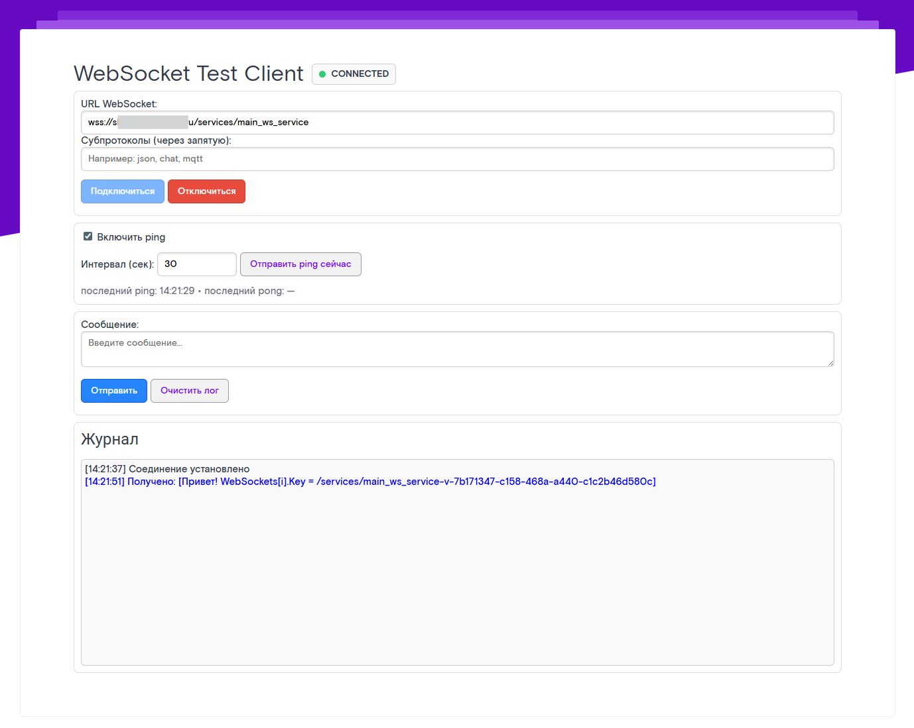
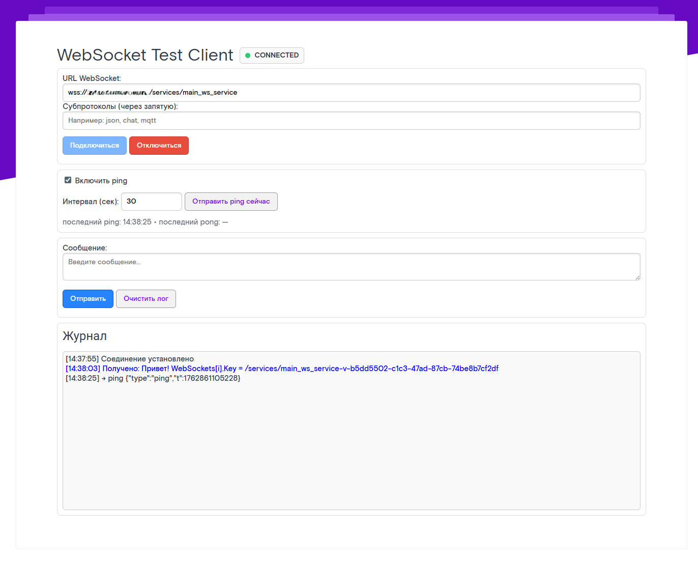
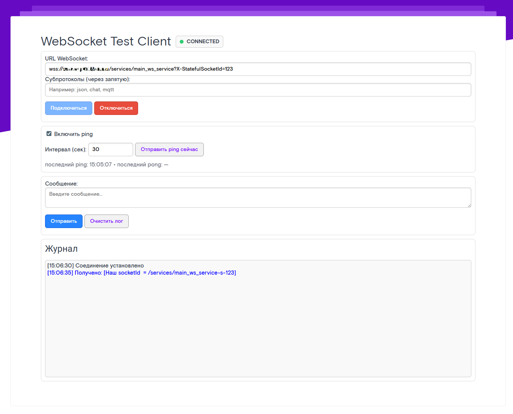
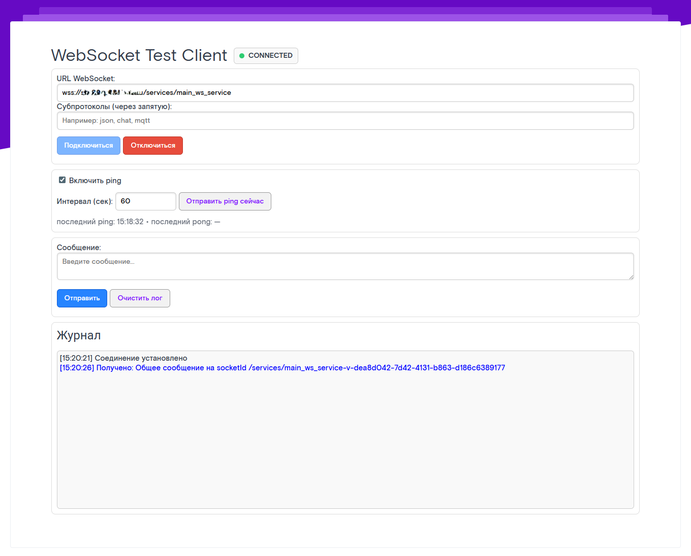
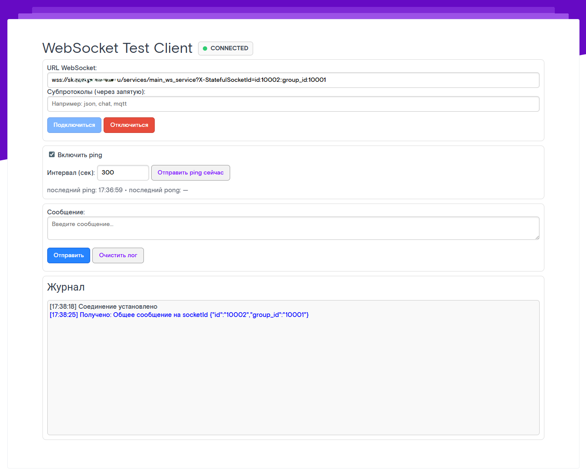

# WebSocket'ы в WebTutor

## Подготовка

Для тестирования WebSocket будем использовать сгенерированную ИИ [HTML страницу](./ws-client.html).

Я создам `Настраиваемый web-шаблон` в WebTutor, скопирую туда весь код из [HTML страницы](./ws-client.html) и буду использовать его (/_wt/doc_type/custom_web_template_id/1111111111111111111)

## Простое использование

Простое использование - подключение к сервису по умолчанию `main_ws_service`

### Первое подключение

Заходим на страницу тестирования, вводим в строку `URL WebSocket` адрес нашего DEV-сервера и жмем кнопку подключиться. При успешном подключении видим зеленый статус `🟢 CONNECTED`


!!! warning "Важно"
	Для подключения необходимо использовать протокол HTTPS, иначе соединение не установится.

### Первое сообщение

Для отправки сообщений на клиент можно использовать любой серверный код. Для примера создадим агент со следующим кодом и запустим его на сервере:

``` javascript
// Получаем доступ к сборке .NET
xHttpStaticAssembly = tools.get_object_assembly( 'XHTTPMiddlewareStatic' ); 

// Получаем список всех подключённых клиентов
WebSockets = xHttpStaticAssembly.CallClassStaticMethod( 'Datex.XHTTP.WebSocketContext', 'GetWebSockets').ToArray(); 

// Рассылаем сообщение каждому клиенту
for(i = 0; i < WebSockets.length; i++) { 
    xHttpStaticAssembly.CallClassStaticMethod( 
        'Datex.XHTTP.WebSocketContext', 
        'WriteToWebSocketMessageQueue', 
        [
            WebSockets[i].Key,
            'Привет! WebSockets[i].Key = ' + WebSockets[i].Key,
            true
        ] 
    ); 
}
```

`get_object_assembly` — это функция WebTutor, которая загружает .NET-сборку (Datex.XHTTP.dll) и возвращает объект-обёртку, позволяющий вызывать статические методы классов внутри неё.

`GetWebSockets()` — это статический метод из Datex.XHTTP.WebSocketContext, который возвращает коллекцию `IEnumerable<KeyValuePair<string, WebSocket>>`,
где:

* `Key` — строковый идентификатор соединения (socketId), уникальный для каждого клиента

* `Value` — объект System.Net.WebSockets.WebSocket, сам сокет клиента

`.ToArray()` просто делает из этого перечисления массив, чтобы удобно было итерироваться в JS-цикле.

`WriteToWebSocketMessageQueue` это статический метод, который кладёт сообщение в очередь исходящих сообщений для конкретного сокета. Сообщения из этой очереди потом отправляются асинхронно внутренним обработчиком WebSocketContext. Параметры:

* `socketId` - идентификатор WebSocket-соединения (тот самый WebSockets[i].Key)

* `message` - текст сообщения, который будет отправлен клиенту

* `json_compound` - флаг, указывающий, нужно ли упаковывать сообщение как JSON (или просто отправить строку)


На клиенте должны увидеть сообщение от сервера

{==*ответ с json_compound = true*==}


{==*ответ с json_compound = false*==}


!!! warning "Важно"
	В этом примере отправка сообщений будет происходить всем клиентам с установленным соединением `WebSocket`

### Отправка конкретному клиенту

В предудущем примере, при подключении к `WebSocket`, нам присваивался случайный `socketId` `main_ws_service-<v-...>`

Чтобы указать нужный нам идентификатор, используется `GET` параметр `X-StatefulSocketId`. Этот параметр присваивает нашему соединению указанный идентификатор. Если повторно подключиться и указать тот же `X-StatefulSocketId`, сервер узнает тебя и свяжет новое соединение с тем же состоянием. 

Получим наш `socketId` и вернем его клиенту:
``` javascript
xHttpStaticAssembly = tools.get_object_assembly( 'XHTTPMiddlewareStatic' ); 
WebSockets = xHttpStaticAssembly.CallClassStaticMethod( 'Datex.XHTTP.WebSocketContext', 'GetWebSockets').ToArray(); 

for(i = 0; i < WebSockets.length; i++) { 
    xHttpStaticAssembly.CallClassStaticMethod( 
        'Datex.XHTTP.WebSocketContext', 
        'WriteToWebSocketMessageQueue', 
        [
            WebSockets[i].Key,
            'Наш socketId  = ' + WebSockets[i].Key,
            true
        ]
    ); 
}
```

{==*видим в сообщении наш socketId*==}


Теперь мы знаем, как определить нужное соединение, отправим сообщение нужному клиенту. Для проверки откроем несколько соединений, один без указания `socketId`, другой с указанием `socketId` и отправим 2 сообщения.

``` javascript
// Получаем доступ к сборке .NET
xHttpStaticAssembly = tools.get_object_assembly( 'XHTTPMiddlewareStatic' ); 

// Получаем список всех подключённых клиентов
WebSockets = xHttpStaticAssembly.CallClassStaticMethod( 'Datex.XHTTP.WebSocketContext', 'GetWebSockets').ToArray(); 

// Рассылаем сообщение каждому клиенту
for(i = 0; i < WebSockets.length; i++) { 
    socketId = WebSockets[i].Key
    xHttpStaticAssembly.CallClassStaticMethod( 
        'Datex.XHTTP.WebSocketContext', 
        'WriteToWebSocketMessageQueue', 
        [
            socketId,
            'Общее сообщение на socketId ' + WebSockets[i].Key,
            false
        ]
    ); 

    if (!StrEnds(socketId, 's-123', true)) continue
    xHttpStaticAssembly.CallClassStaticMethod( 
        'Datex.XHTTP.WebSocketContext', 
        'WriteToWebSocketMessageQueue', 
        [
            socketId,
            'Личное сообщение на socketId' + WebSockets[i].Key,
            false
        ]
    ); 
}
```

{==*клиент без socketId*==}


{==*клиент с socketId*==}



### Отправка группе клиентов

Сервис `main_ws_service` принимает только один параметр `X-StatefulSocketId`, по-этому, самый простой способ отправить группе - зашифровать группу в этом параметре :)

Сделаем 4 разных подключения:

`wss://sks02ap201.ks.rt.ru/services/main_ws_service?X-StatefulSocketId=id:10001::group_id:10001`
`wss://sks02ap201.ks.rt.ru/services/main_ws_service?X-StatefulSocketId=id:10002::group_id:10001`
`wss://sks02ap201.ks.rt.ru/services/main_ws_service?X-StatefulSocketId=id:10003::group_id:10002`
`wss://sks02ap201.ks.rt.ru/services/main_ws_service?X-StatefulSocketId=id:10004::group_id:10002`

Для отправки группе `10002` запустим код

``` javascript
// Получаем доступ к сборке .NET
xHttpStaticAssembly = tools.get_object_assembly( 'XHTTPMiddlewareStatic' ); 

// Получаем список всех подключённых клиентов
WebSockets = xHttpStaticAssembly.CallClassStaticMethod( 'Datex.XHTTP.WebSocketContext', 'GetWebSockets').ToArray(); 

// Рассылаем сообщение каждому клиенту
for(i = 0; i < WebSockets.length; i++) { 
    socketId = WebSockets[i].Key
    data = socketId.split('-s-')[1]
    params_str = data.split('::')
    params = {}
    for (param_str in params_str) {
        values = param_str.split(':')
        params.SetProperty(values[0], values[1])
    }
    
    xHttpStaticAssembly.CallClassStaticMethod( 
        'Datex.XHTTP.WebSocketContext', 
        'WriteToWebSocketMessageQueue', 
        [
            socketId,
            'Общее сообщение на socketId ' + tools.object_to_text(params, 'json'),
            false
        ]
    ); 

    if (params.GetOptProperty('group_id') == '10002') {
        xHttpStaticAssembly.CallClassStaticMethod( 
            'Datex.XHTTP.WebSocketContext', 
            'WriteToWebSocketMessageQueue', 
            [
                socketId,
                'Групповое сообщение группе ' + params.GetOptProperty('group_id'),
                false
            ]
        ); 
    }
}
```

{==*группа 10001*==}


{==*группа 10001*==}


{==*группа 10002*==}


{==*группа 10002*==}


## Сложное использование

Сложное использование - написать свой сервис...